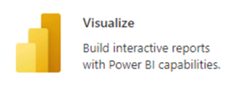
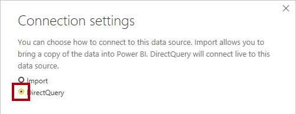
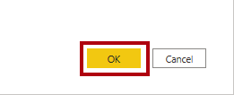

---
lab:
  title: 创建星型架构模型
  module: Prepare data for tabular models in Power BI
---

# 创建星型架构模型

## 概述

完成本实验室预计需要 30 分钟

在此实验室中，你将使用 Power BI Desktop 基于 Azure Synapse Adventure Works 数据仓库开发数据模型。 该数据模型允许在数据仓库上发布语义层。

在此实验室中，你将了解如何完成以下操作：

- 创建与 Azure Synapse Analytics SQL 池的 Power BI 连接。

- 开发模型查询。

- 组织模型图。

## 入门

在本练习中，你将准备环境。

### 将数据加载到 Azure Synapse Analytics

   > 注意：如果已使用 git 克隆将数据加载到 Azure Synapse Analytics 中，则可以跳过此任务并继续“设置 Power BI” 。

1. 使用 VM 右侧“资源”选项卡上的登录信息登录到 [Azure 门户](https://portal.azure.com)。
2. 使用页面顶部搜索栏右侧的 [\>_] 按钮在 Azure 门户中创建新的 Cloud Shell，在出现提示时选择“PowerShell”环境并创建存储。 Cloud Shell 在 Azure 门户底部的窗格中提供命令行界面，如下所示：

    

    > 注意：如果以前创建了使用 Bash 环境的 Cloud shell，请使用 Cloud Shell 窗格左上角的下拉菜单将其更改为“PowerShell”。

3. 请注意，可以通过拖动窗格顶部的分隔条或使用窗格右上角的 &#8212;、&#9723; 或 X 图标来调整 Cloud Shell 的大小，以最小化、最大化和关闭窗格  。 有关如何使用 Azure Cloud Shell 的详细信息，请参阅 [Azure Cloud Shell 文档](https://docs.microsoft.com/azure/cloud-shell/overview)。

4. 在 PowerShell 窗格中，输入以下命令以克隆此存储库：

    ```
    rm -r dp500 -f
    git clone https://github.com/MicrosoftLearning/DP-500-Azure-Data-Analyst dp500
    ```

5. 克隆存储库后，输入以下命令以更改为 setup 文件夹，然后运行其中包含的 setup.ps1 脚本 ：

    ```
    cd dp500/Allfiles/04
    ./setup.ps1
    ```

6. 出现提示时，输入要为 Azure Synapse SQL 池设置的合适密码。

    > 注意：请务必记住此密码！

7. 等待脚本完成 - 这通常需要大约 20 分钟；但在某些情况下可能需要更长的时间。
8. 在创建 Synapse 工作区和 SQL 池并加载数据后，脚本将暂停池以防止产生不必要的 Azure 费用。 准备好在 Azure Synapse Analytics 中使用数据时，需要恢复 SQL 池。

### 克隆本课程的存储库

1. 在“开始”菜单上，打开“命令提示符”

    
2. 在命令提示符窗口中，键入以下内容导航到 D 驱动器：

    `d:`

   按 Enter。

    

3. 在命令提示符窗口中，输入以下命令以下载课程文件并将其保存到名为 DP500 的文件夹中。

   `git clone https://github.com/MicrosoftLearning/DP-500-Azure-Data-Analyst DP500`

4. 克隆存储库后，在文件资源管理器中打开 D 驱动器，以确保文件已下载。

### 设置 Power BI

在此任务中，你将设置 Power BI。

1. 若要打开 Power BI Desktop，请在任务栏上选择 Power BI Desktop 快捷方式。

2. 通过选择右上角的“X”来关闭入门窗口。

3. 如果尚未登录，请在 Power BI Desktop 右上角选择“登录”。 使用实验室凭据完成登录过程。

4. 你将重定向到 Microsoft Edge 中的 Power BI 注册页面。 选择“继续”以完成注册。

   

5. 输入 10 位电话号码，然后选择“开始”。 再次选择“开始”。 你将重定向到 Power BI。

6. 在右上角选择“个人资料”图标，然后选择“开始试用”。

   

7. 出现提示时，选择“开始试用”。

8. 执行所有剩余任务以完成试用设置。

   提示：Power BI Web 浏览器体验称为 Power BI 服务**。

9. 选择“工作区”和“创建工作区”。

    

10. 创建名为 DP500 labs 的工作区，然后选择“保存”。

    注意：工作区名称在租户中必须是唯一的。如果收到错误，请更改工作区名称。

11. 导航回 Power BI Desktop。 如果在屏幕右上角看到“登录”，请使用实验室环境的“资源”选项卡上提供的凭据再次登录。 如果已登录，请继续下一步。

12. 转到 Power BI Desktop，依次选择“文件”、“选项和设置”、“选项”、“安全”，然后在“身份验证浏览器”下选中“使用我的默认 Web 浏览器”，然后选择“确定”     。 关闭 Power BI Desktop。 请勿保存文件。

    在下一个练习中，你将再次打开 Power BI Desktop。

### 启动 SQL 池

在此任务中，你将启动 SQL 池。

1. 在 Microsoft Edge 中，转到 [https://portal.azure.com](https://portal.azure.com/)。

1. 使用实验室凭据完成登录过程。

1. 从 Azure 服务中选择 Azure Synapse Analytics。 选择 Synapse 工作区。

   

1. 找到并选择专用 SQL 池。

   

1. 恢复 SQL 池。

   

   重要说明：SQL 池是一种成本高昂的资源。请在处理此实验室时限制此资源的使用。此实验室中的最终任务会指示你暂停使用资源。

### 将 Power BI 工作区链接到 Azure Synapse Analytics

在此任务中，你将把现有 Power BI 工作区链接到 Azure Synapse Analytics 工作区。

1. 在 Azure 门户的专用 SQL 池中，从功能区中选择“在 Synapse Studio 中打开”。

1. 在 Azure Synapse Studio 主页上，选择“可视化”以链接 Power BI 工作区。

   

1. 从“工作区名称”下拉列表中，选择在上一个任务中创建的工作区，然后选择“创建” 。

 


1. 导航到“管理”并选择“全部发布”以确保发布更改 。

## 开发数据模型

在本练习中，你将开发一个 DirectQuery 模型，以支持数据仓库分销商销售主题的 Power BI 分析和报告。

### 下载数据集文件

在此任务中，你将从 Synapse Studio 中下载 Power BI 数据源文件。

1. 在 Synapse Studio 的左侧，选择“开发”中心 。

 

2. 在“开发”窗格中，展开 Power BI，然后展开工作区，然后选择“Power BI 数据集”  。 如果不存在，请单击“全部发布”以发布工作区并刷新浏览器。

 

 注意：如果在此处看不到任何数据，请确认专用 SQL 池正在运行，并且 Power BI 工作区已链接到 Synapse 工作区。

3. 在“Power BI 数据集”窗格中，选择“新建 Power BI 数据集” 。

 

4. 在左窗格底部，选择“开始”。

 

5. 选择 SQL 池 sqldw，然后选择“继续” 。

 

6. 选择“下载”以下载 .pbids 文件。

 

 .pbids 文件包含与 SQL 池的连接。这是启动项目的一种便捷方法。打开后，它将创建一个新的 Power BI Desktop 解决方法，该解决方法已将连接详细信息存储到 SQL 池。

7. .pbids 文件下载完成后，请将其打开。

 打开文件时，系统会提示你使用连接来创建查询。你将在下一个任务中定义这些查询。

### 创建模型查询

在此任务中，你将创建五个 Power Query 查询，每个查询将作为表加载到模型。

1. 在 Power BI Desktop 的“SQL Server数据库”窗口中，在左侧选择“Microsoft 帐户” 。

 

2. 选择“登录”。

3. 使用提供的实验室 Azure 凭据登录。

4. 选择“连接”。

 

5. 在“导航器”窗口中，选择（不选中）DimDate 表 。

6. 请注意右窗格中的预览结果，其中显示了表行的子集。

 

7. 若要创建（将成为模型表的）查询，请选中以下七个表：

- DimDate

- DimProduct
  
- DimProductCategory
  
- DimProductSubcategory

- DimReseller

- DimSalesTerritory

- FactResellerSales

8. 若要将转换应用于查询，请在右下角选择“转换数据”。

 

 通过转换数据，可以定义模型中可用的数据。

9. 在“连接设置”窗口中，选择 DirectQuery 选项 。

 

 这个决定很重要。DirectQuery 是一种存储模式。使用 DirectQuery 存储模式的模型表不存储数据。因此，当 Power BI 报表视觉对象查询 DirectQuery 表时，Power BI 会向数据源发送原生查询。此存储模式可用于大型数据存储，如 Azure Synapse Analytics（因为导入大量数据可能不切实际或不经济），或用于需要近实时结果的情况。

10. 选择“确定”。

 

11. 在“Power Query 编辑器”窗口的“查询”窗格（位于左侧）中，请注意，选中的每个表都有一个查询 。

 现在，你将修改每个查询的定义。每个查询在应用于模型时都将成为模型表。现在你将重命名查询，以便以更友好、更简洁的方式描述它们，并应用转换来传递已知报告要求所需的列。

12. 选择 DimDate 查询。

 

13. 在“查询设置”窗格（位于右侧）的“名称”框中，将文本替换为“Date”，然后按 Enter 键，以重命名查询   。

 

14. 若要删除不必要的列，请在“开始”功能区选项卡上的“管理列”组中，选择“选择列”图标  。

 

15. 在“选择列”窗口中，若要取消选中所有复选框，请取消选中第一个复选框。

 

16. 检查以下五列。

- DateKey

- FullDateAlternateKey

- EnglishMonthName

- FiscalQuarter

- FiscalYear

 

 此列选择决定了模型中可用的列。

17. 选择“确定”。

 

18. 在“查询设置”窗格的“应用步骤”列表中，请注意添加了一个用于删除其他列的步骤 。

 

 Power Query 定义用于实现所需结构和数据的步骤。每个转换都是查询逻辑中的一个步骤。

19. 若要重命名“FullDateAlternateKey”列，请双击“FullDateAlternateKey”列标题 。

20. 将文本替换为 Date，然后按 Enter 键 。

 

21. 请注意，新应用的步骤将添加到查询中。

 

22. 为以下列重命名：

- 将 EnglishMonthName 重命名为 Month

- 将 FiscalQuarter 重命名为 Quarter

- 将 FiscalYear 重命名为 Year

23. 若要验证查询设计，请在状态栏（位于窗口底部）中，验证查询是否包含五列。

 

 重要说明：如果查询设计不匹配，请查看练习步骤以进行更正。

 现在，Date 查询设计就完成了**。

24. 在“已应用步骤”窗格中，右键单击最后一步，然后选择“查看原生查询” 。

 

25. 在“原生查询”窗口中，查看反映查询设计的 SELECT 语句。

 这个概念很重要。原生查询是 Power BI 用于查询数据源的内容。为确保最佳性能，数据库开发人员应通过创建适当的索引等方式来确保此查询得到优化。

26. 若要关闭“原生查询”窗口，请选择“确定” 。

 

27. 选择 DimProductCategory 表。

28. 将查询重命名为“产品详细信息”。

29. 在功能区“主页”选项卡上的“合并”组中，选择“合并查询”。

 注意：我们正在合并查询以获取产品详细信息、类别和子类别。这将在“产品”维度中使用。

30. 选择 DimProductSubcategory 表，然后选择每个表中的 ProductCategoryKey 列 。 选择“确定”。

 

 注意：对此合并使用默认联接，即左外部联接。

31. 展开 DimProductSubcategory 列。 选择 ProductSubcategoryKey 和 EnglishProductSubcategoryName 列 。 取消选择“使用原始列名作为前缀”。

 

 此扩展功能允许基于源数据中的外键约束联接表。本实验室采用的设计方法是将雪花维度表联接在一起，以生成数据的非规范化表示形式。

32. 选择“确定”。

33. 将 DimProductSubcategory.ProductSubcategoryKey 列重命名为 ProductSubcategoryKey，将 DimProductSubcategory.EnglishProductSubcategoryName 重命名为 EnglishProductSubcategoryName   。

34. 删除所有列，以下列除外：

   - ProductSubcategoryKey

   - EnglishProductCategoryName

   - EnglishProductSubcategoryName

   现在应该得到 3 列、37 行。

35. 选择 DimProduct 查询。

 

36. 将查询重命名为 Product。

 

37. 在功能区“主页”选项卡上的“合并”组中，选择“合并查询”。

38. 选择“产品详细信息”表，然后在“产品”表和“产品详细信息”表中选择 ProductSubcategoryKey 列 。

    

39. 选择“确定”。

40. 展开“产品详细信息”列，然后选择 EnglishProductSubcategoryName 和 EnglishProductCategoryName 列 。

    

41. 选择“确定”。

42. 若要筛选查询，请在 FinishedGoodsFlag 列标题中打开下拉菜单，取消选中 FALSE 。

 

43. 选择“确定”。

44. 为以下列重命名：

- 将 EnglishProductName 重命名为 Product

- 将 Product Details.EnglishProductCategoryName 重命名为 Subcategory

- 将 Product Details. 重命名为 Category

45. 删除所有列，以下列除外：

- ProductKey

- 产品

- Color

- Subcategory

- 类别

46. 在“已应用步骤”窗格中，右键单击最后一步，然后选择“查看原生查询” 。

 

47. 在“原生查询”窗口中，查看反映查询设计的 SELECT 语句。

48. 若要关闭“原生查询”窗口，请选择“确定” 。

49. 验证查询是否包含五列。

 现在，Product 查询设计就完成了**。

50. 选择 DimReseller 查询。

 

51. 将查询重命名为 Reseller。

52. 删除所有列，以下列除外：

- ResellerKey

- BusinessType

- ResellerName

53. 为以下列重命名：

- 将 BusinessType 重命名为 Business Type（用空格分开）

- 将 ResellerName 重命名为 Reseller

54. 验证查询是否包含三列。

 现在，Reseller 查询设计就完成了**。

55. 选择 DimSalesTerritory 查询。

 

56. 将查询重命名为 Territory。

57. 删除所有列，以下列除外：

- SalesTerritoryKey

- SalesTerritoryRegion

- SalesTerritoryCountry

- SalesTerritoryGroup

58. 为以下列重命名：

- 将 SalesTerritoryRegion 重命名为 Region

- 将 SalesTerritoryCountry 重命名为 Country

- 将 SalesTerritoryGroup 重命名为 Group

59. 验证查询是否包含四列。

 现在，Territory 查询设计就完成了**。

60. 选择 FactResellerSales 查询。

 

61. 将查询重命名为 Sales。

62. 删除所有列，以下列除外：

- ResellerKey

- ProductKey

- OrderDateKey

- SalesTerritoryKey

- OrderQuantity

- UnitPrice

 

63. 为以下列重命名：

- 将 OrderQuantity 重命名为 Quantity

- 将 UnitPrice 重命名为 Price

64. 若要添加计算列，请在“添加列”功能区选项卡上的“常规”组中，选择“自定义列”  。

 

65. 在“自定义列”窗口的“新列名”框中，将文本替换为 Revenue  。

 

66. 在“自定义列公式”框中，输入以下公式：

 ```
 [Quantity] * [Price]
 ```

67. 选择“确定”。

68. 若要修改列数据类型，请在“收入”列标题中选择 ABC123，然后选择“十进制数”  。

 

69. 查看原生查询，注意 Revenue 列计算逻辑。

70. 验证查询是否包含七列。

 现在，Sales 查询设计就完成了**。

71. 右键单击“产品详细信息”表，然后取消选择“启用加载” 。 这样会禁止将“产品详细信息”表加载到数据模型，并且不会显示在报表中。

 

72. 重复此步骤，为 DimProductSubcategory 表取消选择“启用加载”。

73. 若要应用查询，请在“主页”功能区选项卡上，从“关闭”组中选择“关闭并应用”图标  。

 

 每个查询都用于创建模型表。由于数据连接使用的是 DirectQuery 存储模式，因此仅创建模型结构，不导入任何数据。该模型现在由每个查询的一个表组成。

74. 在 Power BI Desktop 中，应用查询后，请注意状态栏左下角的模型存储模式为 DirectQuery。

 

### 组织模型关系图

在此任务中，你将组织模型图，以便轻松了解星型架构设计。

1. 在 Power BI Desktop 左侧，选择“模型”视图。

 

2. 要调整模型图的大小以适应屏幕，请在右下角选择“适应屏幕”图标。

 

3. 将表拖动到适当的位置，以便 Sales 事实数据表位于关系图的中间，而其余表（即维度表）位于事实数据表周围。

4. 如果任何维度表都与事实数据表无关，请使用以下说明创建关系：

- 拖动维度键列（例如 ProductKey），并将其放在 Sales 表的相应列上 。

- 在“创建关系”窗口中，选择“确定” 。

5. 查看模型关系图的最终布局。

 

 星型架构模型的创建现已完成。现在可以应用许多建模配置，例如添加层次结构、计算和设置列可见性等属性。

6. 若要保存解决方案，请在左上角选择“文件”菜单，然后在其中选择“另存为” 。

7. 在“另存为”窗口中，转到“D：\DP500\Allfiles\04\MySolution”文件夹 。

8. 在“文件名”框中，输入“Sales Analysis” 。

 

9. 选择“保存”。

10. 关闭 Power BI Desktop。

### 暂停 SQL 池

在此任务中，你将停止 SQL 池。

1. 在 Web 浏览器中，转到 https://portal.azure.com。

2. 查找 SQL 池。

3. 暂停 SQL 池。
