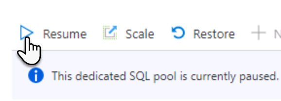
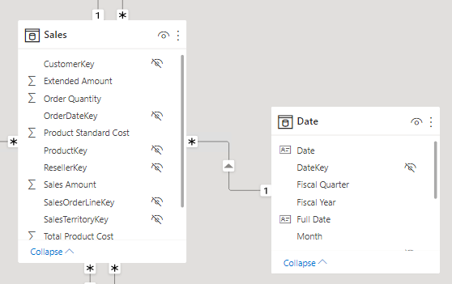
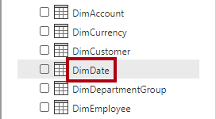
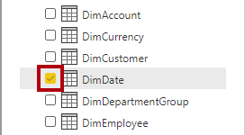
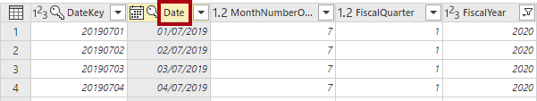
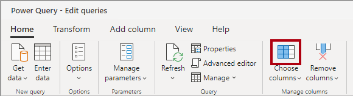
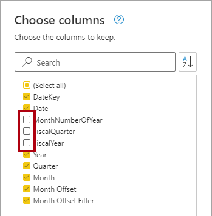
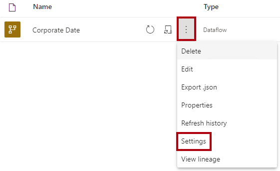
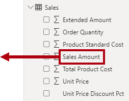

---
lab:
  title: 创建数据流
  module: Prepare data for tabular models in Power BI
---

# 创建数据流

## 概述

**预估完成本实验室需要 45 分钟**

在本实验室中，你将创建一个数据流来提供源自 Azure Synapse Adventure Works 数据仓库的日期维度数据。 该数据流将提供与日期相关的数据的一致定义，供组织的业务分析师使用。

在此实验室中，你将了解如何完成以下操作：

- 使用 Power Query Online 开发数据流。

- 借助 Power BI Desktop 使用数据流。

## 入门

在本练习中，需要准备好环境。

### 将数据加载到 Azure Synapse Analytics

   > 注意：如果已使用 git 克隆将数据加载到 Azure Synapse Analytics 中，则可以跳过此任务并继续“设置 Power BI” 。

1. 使用 VM 右侧“资源”选项卡上的登录信息登录到 [Azure 门户](https://portal.azure.com)。
2. 使用页面顶部搜索栏右侧的 [\>_] 按钮在 Azure 门户中创建新的 Cloud Shell，在出现提示时选择“PowerShell”环境并创建存储。 Cloud Shell 在 Azure 门户底部的窗格中提供命令行界面，如下所示：

    

    > 注意：如果以前创建了使用 Bash 环境的 Cloud shell，请使用 Cloud Shell 窗格左上角的下拉菜单将其更改为“PowerShell”。

3. 请注意，可以通过拖动窗格顶部的分隔条或使用窗格右上角的 &#8212;、&#9723; 或 X 图标来调整 Cloud Shell 的大小，以最小化、最大化和关闭窗格  。 有关如何使用 Azure Cloud Shell 的详细信息，请参阅 [Azure Cloud Shell 文档](https://docs.microsoft.com/azure/cloud-shell/overview)。

4. 在 PowerShell 窗格中，输入以下命令以克隆此存储库：

    ```
    rm -r dp500 -f
    git clone https://github.com/MicrosoftLearning/DP-500-Azure-Data-Analyst dp500
    ```

5. 克隆存储库后，输入以下命令以更改为 setup 文件夹，然后运行其中包含的 setup.ps1 脚本 ：

    ```
    cd dp500/Allfiles/04
    ./setup.ps1
    ```

6. 出现提示时，输入要为 Azure Synapse SQL 池设置的合适密码。

    > 注意：请务必记住此密码！

7. 等待脚本完成 - 这通常需要大约 20 分钟；但在某些情况下可能需要更长的时间。

1. 在创建 Synapse 工作区和 SQL 池并加载数据后，脚本将暂停池以防止产生不必要的 Azure 费用。 准备好在 Azure Synapse Analytics 中使用数据时，需要恢复 SQL 池。

### 克隆本课程的存储库

1. 在“开始”菜单上，打开“命令提示符”

    

1. 在命令提示符窗口中，键入以下内容导航到 D 驱动器：

    `d:` 

   按 Enter。

    


1. 在命令提示符窗口中，输入以下命令以下载课程文件并将其保存到名为 DP500 的文件夹中。
    
    `
    git clone https://github.com/MicrosoftLearning/DP-500-Azure-Data-Analyst DP500
    `
   
2. 克隆存储库后，关闭命令提示符窗口。 
   
3. 在文件资源管理器中打开 D 驱动器，确保文件已下载。

### 设置 Power BI Desktop

在此任务中，你将设置 Power BI Desktop。

1. 若要打开文件资源管理器，请选择任务栏上的文件资源管理器快捷方式。

1. 导航到 D:\DP500\Allfiles\05\Starter 文件夹。

1. 若要打开预先开发的 Power BI Desktop 文件，请双击“Sales Analysis - Create a dataflow.pbix”文件。

1. 如果尚未登录，请在 Power BI Desktop 右上角选择“登录”。 使用实验室凭据完成登录过程。

    

1. 若要保存文件，请在“文件”功能区上选择“另存为” 。

1. 在“另存为”窗口中，转到 D:\DP500\Allfiles\05\MySolution 文件夹 。

1. 转到 Power BI Desktop，依次选择“文件”、“选项和设置”、“选项”、“安全性”，然后在“身份验证浏览器”下选中“使用我的默认 Web 浏览器”，然后选择“保存”     。

    你将更新 Power BI Desktop 解决方案以使用数据流来获取日期维度数据。

### 登录到 Power BI 服务

在此任务中，你将登录到 Power BI 服务并启动试用许可证，然后创建工作区。

重要说明：如果已在 VM 环境中设置 Power BI，请继续执行下一个任务。

1. 在 Web 浏览器中，转到 https://powerbi.com。

1. 使用实验室凭据完成登录过程。

    重要说明：请务必使用登录 Power BI Desktop 时使用的凭据。

1. 在右上角选择“个人资料”图标，然后选择“开始试用”。

    

1. 出现提示时，选择“开始试用”。


2. 执行所有剩余任务以完成试用设置。

    提示：Power BI Web 浏览器体验称为 Power BI 服务**。

9. 选择“工作区”和“创建工作区”。

    

10. 创建名为 DP500 labs 的工作区，然后选择“保存”。

    注意：工作区名称在租户中必须是唯一的。如果收到错误，请更改工作区名称。

创建后会打开该工作区。 在下一个练习中，你将为此工作区创建数据流。

### 启动 SQL 池

在此任务中，你将启动 SQL 池。

1. 在 Web 浏览器中，转到 https://portal.azure.com。

1. 使用实验室凭据完成登录过程。

1. 使用搜索栏查找 Azure Synapse Analytics。 

1. 选择 Azure Synapse Analytics 实例。
    

1. 找到并选择专用 SQL 池。
    

1. 恢复专用 SQL 池。

    

    重要说明：SQL 池是一种成本高昂的资源。请在使用此实验室时限制此资源的使用。此实验室中的最终任务会指示你暂停使用资源。

## 开发数据流

在本练习中，你将开发用于支持 Power BI 模型开发的数据流。 它将提供数据仓库日期维度表的一致表示。

### 查看数据模型

在此任务中，你将查看在 Power BI Desktop 中开发的数据模型。

1. 切换到 Power BI Desktop 解决方案。

1. 在左侧，切换到“模型”视图。

    

1. 在模型示意图中，请注意 Date 表。

    

    Date 表是由业务分析师创建的。它不表示与日期相关的数据的一致定义，并且不包括用于支持相对日期筛选器的有用偏移列。在稍后的练习中，将此表替换为源自数据流的新表。

### 创建数据流

在此任务中，你将创建表示与日期相关的数据的一致定义的数据流。

1. 在 Power BI 服务中，依次选择“新建”、“数据流” 。

    

1. 在“定义新表”磁贴中，选择“添加新表” 。

    

    添加新表涉及使用 Power Query Online 来定义查询。

1. 要选择数据源，请选择“Azure Synapse Analytics(SQL DW)”。

    

    提示：可以使用搜索框（位于右上角）来帮助查找数据源。

1. 输入“Synapse 连接”设置。

     - 输入 Azure 门户中的服务器名称 
     
     
     
      服务器名称应类似于：
      
      synapsewsxxxxx.sql.azuresynapse.net
      
     - 确保“身份验证类型”为“组织帐户”。 如果系统提示登录，请使用实验室提供的凭据。
     

1. 在右下角，选择“下一步”。

    

1. 在 Power Query 导航窗格中，展开 sqldw 并选择（但不选中）DimDate 表。

    

1. 注意表数据的预览。

1. 要创建查询，请选中 DimDate 表。

    

1. 在右下角，选择“转换数据”。

    

    Power Query Online 现在将用于对表应用转换。它可提供与 Power BI Desktop 中的 Power Query 编辑器几乎相同的体验。

1. 在“查询设置”窗格（位于右侧）的“名称”框中，若要重命名查询，请将文本替换为“Date”，然后按 Enter   。

    

1. 若要删除不必要的列，请在“开始”功能区选项卡上的“管理列”组中，选择“选择列”图标  。

    

1. 在“选择列”窗口中，若要取消选中所有复选框，请取消选中第一个复选框。

    


1. 检查以下五列。

    - DateKey

    - FullDateAlternateKey

    - MonthNumberOfYear

    - FiscalQuarter

    - FiscalYear

    

1. 选择“确定”。

    

  
1. 在“查询设置”窗格的“应用步骤”列表中，请注意添加了一个用于删除其他列的步骤 。

    

    Power Query 定义用于实现所需结构和数据的步骤。每个转换都是查询逻辑中的一个步骤。

1. 若要重命名“FullDateAlternateKey”列，请双击“FullDateAlternateKey”列标题 。

1. 将文本替换为“Date”，然后按 Enter 。

    

1. 若要添加计算列，请在“添加列”功能区选项卡上的“常规”组中，选择“自定义列”  。

    

   

1. 在“自定义列”窗口的“新列名”框中，将文本替换为“Year”  。

1. 在“数据类型”下拉列表中，选择“文本” 。

    

1. 在“自定义列公式”框中，输入以下公式：

    提示：所有公式都可从 D:\DP500\Allfiles\05\Assets\Snippets.txt 复制和粘贴。


    ```
    "FY" & Number.ToText([FiscalYear])
    ```


1. 选择“确定”。

    现在将再添加四个自定义列。

1. 使用以下公式添加另一个名为 Quarter 的自定义列，其数据类型为“文本” ：


    ```
    [Year] & " Q" & Number.ToText([FiscalQuarter])
    ```


1. 使用以下公式添加另一个名为 Month 的自定义列，其数据类型为“文本” ：


    ```
    Date.ToText([Date], "yyyy-MM")
    ```

1. 使用以下公式添加另一个名为 Month Offset 的自定义列（单词之间含空格），其数据类型为“整数” ：


    ```
    ((Date.Year([Date]) * 12) + Date.Month([Date])) - ((Date.Year(DateTime.LocalNow()) * 12) + Date.Month(DateTime.LocalNow()))
    ```


    此公式确定从当前月份开始的月份数。当前月份为零，过去月份为负数，未来月份为正数。例如，上个月的值为 -1。

   

1. 使用以下公式添加另一个名为 Month Offset Filter 的自定义列（单词之间含空格），其数据类型为“文本” ：


    ```
    if [Month Offset] > 0 then Number.ToText([Month Offset]) & " month(s) future"

    else if [Month Offset] = 0 then "Current month"

    else Number.ToText(-[Month Offset]) & " month(s) ago"
    ```


    此公式将数值偏移转换为易记文本格式。

    提示：所有公式都可从 D:\DP500\Allfiles\05\Assets\Snippets.txt 复制和粘贴。

1. 若要删除不必要的列，请在“开始”功能区选项卡上的“管理列”组中，选择“选择列”图标  。

    

1. 在“选择列”窗口中，取消选中以下列：

    - MonthNumberOfYear

    - FiscalQuarter

    - FiscalYear

    

1. 选择“确定”。

1. 在右下角，选择“保存并关闭”。

    

1. 在“保存数据流”窗口的“名称”框中，输入“公司日期”  。

1. 在“说明”框中，输入：在所有 Adventure Works 数据集中使用的一致日期定义 

1. 提示：可从 D:\DP500\Allfiles\05\Assets\Snippets.txt 复制和粘贴此说明。

    

1. 选择“保存”。

    

1. 在 Power BI 服务的“导航”窗格中，选择你的工作区名称。

    此操作将打开工作区的登陆页面。

1. 要刷新数据流，请将光标悬停在“公司日期”数据流上，然后选择“立即刷新”图标 。

    

  

1. 要转到数据流设置，请将光标悬停在“公司日期”数据流上，选择省略号，然后选择“设置” 。

    

1. 注意配置选项。

    

    需要配置两个设置。首先，应将计划刷新配置为每天更新数据流数据。这样，就可以使用当前日期计算月份偏移。其次，数据流应被授权审阅者认可为已认证。已认证的数据流向其他人声明其符合质量标准，可以被视为可靠和权威。

    除了配置设置外，还应授予所有内容创建者使用数据流的权限。

## 使用数据流

在本练习中，在 Power BI Desktop 解决方案中，你将现有的 Date 表替换为从数据流中获取其数据的新表。

### 删除原始 Date 表

在此任务中，你将删除原始 Date 表。

1. 切换到 Power BI Desktop 解决方案。

1. 在模型示意图中，右键单击“Date”表，然后选择“从模型中删除” 。

    

1. 当系统提示删除表时，选择“确定”。

    

  


### 添加新的 Date 表

在此任务中，你将添加从数据流中获取其数据的新 Date 表。

1. 在“主页”功能区的“数据”组中，选择“获取数据”图标  。

    

1. 在“获取数据”窗口的左侧，选择“Power Platform”，然后选择“Power BI 数据流”  。

    

1. 选择“连接”。

    

  

1. 在“Power BI 数据流”窗口中，选择“登录” 。

    

1. 使用实验室凭据完成登录过程。

    重要说明：请务必使用登录 Power BI 服务时使用的凭据。

1. 选择“连接”。

    

1. 在“导航器”窗口的左侧窗格中，展开工作区文件夹，然后展开“公司日期”数据流文件夹 。

    


1. 选中 Date 表。

    

1. 选择“加载”。

    

    可以使用 Power Query 编辑器转换数据。

1. 将新表添加到模型后，通过将 Date 表中“DateKey”列拖到 Sales 表中的“OrderDateKey”列来创建关系   。

    

    还有许多其他可以完成的模型配置，例如隐藏列或创建层次结构。

### 验证模型

在此任务中，通过创建简单的报表布局来测试模型。

1. 在左侧，切换到“报表”视图。

    

1. 要向页面添加视觉对象，请在“可视化效果”窗格中选择堆积条形图视觉对象。

    

1. 调整视觉对象的大小以填充报表页。

  

1. 在“数据”窗格中，展开 Date 表，然后将“Month Offset Filter”字段拖到条形图视觉对象中  。

    

1. 在“数据”窗格中，展开 Sales 表，然后将“Sales Amount”字段拖到条形图视觉对象中  。

    


1. 若要对纵坐标轴进行排序，请选择视觉对象右上角的省略号，然后选择“对轴进行排序” > “月份偏移筛选器” 。

    

1. 为确保月份偏移筛选器值按时间顺序排序，请在“数据”窗格中选择“Month Offset Filter”字段 。

1. 在“列工具”功能区选项卡上，选择“排序”组中的“排序”，然后选择“Month Offset”   。

    

1. 查看现在按时间顺序排序的更新后的条形图视觉对象。

    使用日期偏移列的主要好处是，报表可以自定义方式按相对日期进行筛选。（切片器和筛选器也可以按相对日期和时间段进行筛选，但无法自定义此行为。它们也不允许按季度进行筛选。）

1. 保存 Power BI Desktop 文件。

1. 关闭 Power BI Desktop。

### 暂停 SQL 池

在此任务中，你将停止 SQL 池。

1. 在 Web 浏览器中，转到 https://portal.azure.com。

1. 查找 SQL 池。

1. 暂停 SQL 池。
