---
lab:
  title: 处理模型关系
  module: Design and build tabular models
---

# <a name="work-with-model-relationships"></a>处理模型关系

## <a name="overview"></a>概述

**预估完成本实验室需要 45 分钟**

In this lab, you will work with model relationships specifically to address the need for role-playing dimensions. It will involve working with active and inactive relationships, and also Data Analysis Expressions (DAX) functions that modify relationship behavior.

在此实验室中，你将了解如何完成以下操作：

- 解释模型示意图中的关系属性。

- 设置关系属性。

- 使用用于修改关系行为的 DAX 函数。

## <a name="explore-model-relationships"></a>探索模型关系

In this exercise, you will open a pre-developed Power BI Desktop solution to learn about the data model. You will then explore the behavior of active model relationships.

## <a name="get-started"></a>入门
### <a name="clone-the-repository-for-this-course"></a>克隆本课程的存储库

1. 在“开始”菜单上，打开“命令提示符”
   
    

2. 在命令提示符窗口中，键入以下内容导航到 D 驱动器：

    `d:` 

   按 Enter。
   
    


3. 在命令提示符窗口中，输入以下命令以下载课程文件并将其保存到名为 DP500 的文件夹中。
    
    `git clone https://github.com/MicrosoftLearning/DP-500-Azure-Data-Analyst DP500`
   

1. 克隆存储库后，关闭命令提示符窗口。 
   
1. 在文件资源管理器中打开 D 驱动器，确保文件已下载。

### <a name="set-up-power-bi-desktop"></a>设置 Power BI Desktop

在此任务中，你将打开预先开发的 Power BI Desktop 解决方案。

1. 若要打开文件资源管理器，请选择任务栏上的文件资源管理器快捷方式。

    

2. 在文件资源管理器中，转到 D:\DP500\Allfiles\06\Starter 文件夹。

3. 若要打开预先开发的 Power BI Desktop 文件，请双击“Sales Analysis - Work with model relationships.pbix”文件。

4. 若要保存文件，请在“文件”功能区选项卡上，选择“另存为” 。

5. 在“另存为”窗口中，转到 D:\DP500\Allfiles\06\MySolution 文件夹 。

6. 选择“保存”。

### <a name="review-the-data-model"></a>查看数据模型

在此任务中，你将查看数据模型。

1. 在 Power BI Desktop 中的左侧部分切换到“模型”视图。

    

2. 使用模型关系图查看模型设计。

    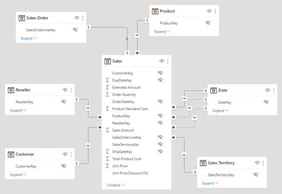

    该模型包括六个维度表和一个事实数据表。Sales 事实数据表存储销售订单详细信息。这是一种典型的星型架构设计。
 
3. 请注意，Date 表和 Sales 表之间存在三种关系 。

    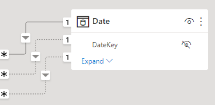

    Date 表中的“DateKey”列是表示关系“1”侧的唯一列。应用于 Date 表的任何列的筛选器使用其中一种关系传播到 Sales 表   。

4. 将光标悬停在这三个关系中的每一个上，以突出显示 Sales 表中的“多”侧列。

5. 请注意，与“OrderDateKey”列的关系为实线，而其他关系则用虚线表示。

    实线表示活动关系。两个模型表之间只能有一个活动关系路径，默认使用该路径在这两个表之间传播筛选器。相反，虚线表示非活动关系。只有在 DAX 公式显式调用时才使用非活动关系。

    当前的模型设计指示 Date 表是一个角色扮演维度。此维度可以扮演订单日期、截止日期或发货日期的角色。具体哪个角色取决于报表的分析要求。

    在本实验室中，你将了解如何设计用于支持角色扮演维度的模型。

### <a name="visualize-date-data"></a>可视化日期数据

在此任务中，你将按日期可视化销售数据并切换关系的活动状态。

1. 切换到“报表”视图。

    

2. 若要添加表视觉对象，请在“可视化效果”窗格中选择“表”视觉对象图标 。

    

3. 若要向表视觉对象添加列，请在“字段”窗格（位于右侧）中，首先展开 Date 表 。

    

4. 将“Fiscal Year”列拖放到表视觉对象中。

    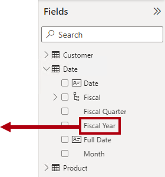

5. 展开以打开 Sales 表，然后将“Sales Amount”列拖放到表视觉对象中 。

    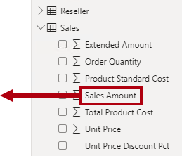

6. 查看表视觉对象。

    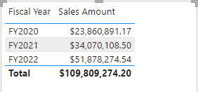

    表视觉对象显示按年份分组的“Sales Amount”列的总和。但“Fiscal Year”是什么意思？由于 Date 表与 Sales 表的“OrderDateKey”列之间存在活动关系，因此 Fiscal Year 表示下订单的会计年度     。

    若要明确是哪个会计年度，最好重命名视觉对象字段（或为视觉对象添加标题）。

7. 在表视觉对象的“可视化效果”窗格的“值”井中，选择向下箭头，然后选择“为此视觉对象重命名”  。

    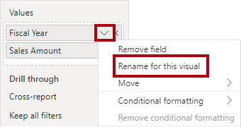

8. 将文本替换为“Order Year”，然后按 Enter 。

    

    提示：双击视觉对象字段的名称可以更快地重命名该视觉对象字段。

9. 请注意，表视觉对象列标题将更新为新名称。

    

### <a name="modify-relationship-active-status"></a>修改关系活动状态

在此任务中，你将修改两个关系的活动状态。

1. 在“建模”功能区上，选择“管理关系” 。

    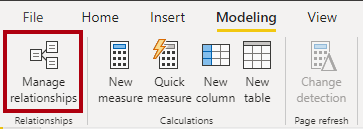

2. 在“管理关系”窗口中，对于 Sales 表的“OrderDateKey”列（列表中的第三个列）与 Date 表之间的关系，取消选中“活动”复选框    。

    

3. 选中表示 Sales 表的“ShipDateKey”列（列表中的最后一个列）与 Date 表之间关系的“活动”复选框   。

    

4. 选择“关闭”。

    

    这些配置已切换 Date 表与 Sales 表的“ShipDateKey”列之间的活动关系  。

5. 查看现在显示按发货年份分组的销售额的表视觉对象。

    

6. 将第一列重命名为“Ship Year”。

    

    第一行表示一个空白组，因为有些订单尚未发货。换句话说，Sales 表的“ShipDateKey”列中存在 BLANK 。

7. 在“管理关系”窗口中，使用以下步骤将“OrderDateKey”关系恢复为活动状态 ：

    - 打开“管理关系”窗口

    - 取消选中“ShipDateKey”关系对应的“活动”复选框（列表中的最后一个列） 

    - 选中“OrderDateKey”关系对应的“活动”复选框（列表中的最后三个列） 

    - 关闭“管理关系”窗口

    - 将表视觉对象中的第一个视觉对象字段重命名为“Order Year”

    

    在下一个练习中，你将了解如何在 DAX 公式中激活关系。

## <a name="use-inactive-relationships"></a>使用非活动关系

在本练习中，你将了解如何在 DAX 公式中激活关系。

### <a name="use-inactive-relationships"></a>使用非活动关系

在此任务中，你将使用 USERELATIONSHIP 函数来激活非活动关系。

1. 在“字段”窗格中，右键单击“Sales”表，然后选择“新建度量值”  。

    

2. 在编辑栏（位于功能区下方）中，将文本替换为以下度量值定义，然后按 Enter。

    提示：所有公式都可从 D:\DP500\Allfiles\06\Assets\Snippets.txt 复制和粘贴。

    ```
    Sales Shipped =
    CALCULATE (
    SUM ( 'Sales'[Sales Amount] ),
    USERELATIONSHIP ( 'Date'[DateKey], 'Sales'[ShipDateKey] )
    )
    ``` 
    此公式使用 CALCULATE 函数来修改筛选器上下文。出于此计算目的，正是 USERELATIONSHIP 函数激活了“ShipDateKey”关系。

3. 在“度量工具”上下文功能区中的“格式”组中，将小数位数设置为 2  。

    

4. 将“Sales Shipped”度量值添加到表视觉对象。

    

5. 扩大表视觉对象，使所有列都完全可见。

    

    创建临时将关系设置为活动的度量值是使用角色扮演维度的一种方法。但是，如果需要为许多措施创建角色扮演版本，它可能会变得十分繁琐。例如，如果有 10 个与销售相关的度量值和三个角色扮演日期，这可能意味着将创建 30 个度量值。使用计算组可以更容易地创建这些度量值。

    另一种方法是为每个角色扮演维度创建不同的模型表。你将在下一个练习中这样做。

6. 要从表视觉对象中删除度量值，请在“可视化效果”窗格中的“值”井中，对于“Sales Shipped”字段，请按 X   。

    

## <a name="add-another-date-table"></a>添加另一个 Date 表

在本练习中，你将添加用于支持发货日期分析的日期表。

### <a name="remove-the-inactive-relationships"></a>删除非活动关系

在此任务中，你将删除与“ShipDateKey”列的现有关系。

1. 切换到“模型”视图。

    

2. 在模型示意图中，右键单击“ShipDateKey”关系，然后选择“删除” 。

    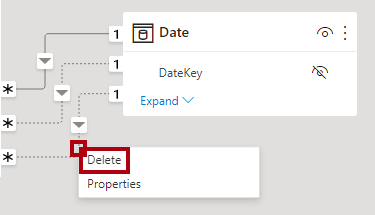

3. 当看到确认删除的提示时，选择“确定”。

    

    删除关系将导致“Sales Shipped”度量值出错。你将在本实验室的后面部分重写度量值公式。

### <a name="disable-relationship-options"></a>禁用关系选项

在此任务中，你将禁用两个关系选项。

1. 在“文件”功能区选项卡上，选择“选项和设置”，然后选择“选项”  。

    

2. 在“选项”窗口左下角的“当前文件”组中，选择“数据加载”  。

    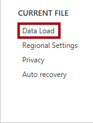

3. 在“关系”部分，取消选中两个已启用的选项。

    

    通常，在日常工作中，可以启用这些选项。但就本实验室而言，你将显式创建关系。

4. 选择“确定”。

    

### <a name="add-another-date-table"></a>添加另一个日期表

在此任务中，你将创建用于将另一个日期表添加到模型中的查询。

1. 在“主页”功能区选项卡的“查询”组中，选择“转换数据”图标  。

     

    如果系统提示指定连接方式，请单击“编辑凭据”并指定登录方式。

    

    选择“连接”

     
 
2. 在“Power Query 编辑器”窗口的“查询”窗格（位于左侧）中，右键单击“日期”查询，然后选择“引用”   。

    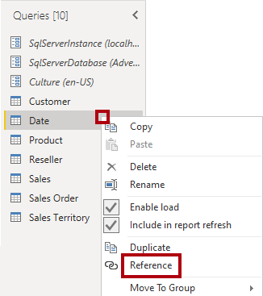

    引用查询是使用其他查询作为其来源的查询。因此，此新查询从“日期”查询中获取其日期。

3. 在“查询设置”窗格（位于右侧）的“名称”框中，将文本替换为“Ship Date”  。

    

4. 若要重命名“DateKey”列，请双击“DateKey”列标题 。

5. 将文本替换为“ShipDateKey”，然后按 Enter 。

    

6. 此外，还需将“Fiscal Year”列重命名为“Ship Year” 。

    如果可能，最好重命名所有列，以便描述其所扮演的角色。在本实验室中，为简单起见，只重命名两个列。

7. 要将表加载到模型中，请在“主页”功能区选项卡上选择“关闭并应用”图标 。

    

8. 将表添加到模型后，若要创建关系，请从 Ship Date 表将“ShipDateKey”列拖到 Sales 表的“ShipDateKey”列   。

    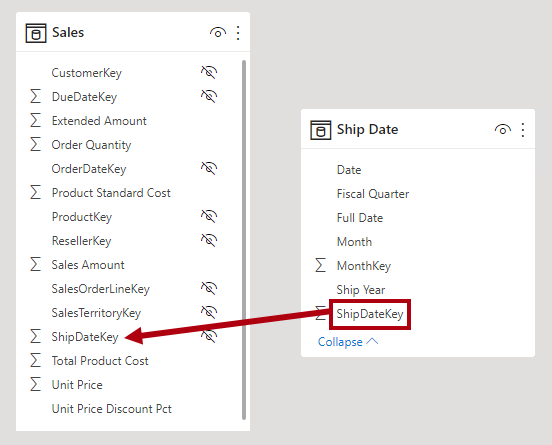

9. 请注意，现在 Ship Date 表和 Sales 表之间存在活动关系 。

### <a name="visualize-ship-date-data"></a>可视化发货日期数据

在此任务中，你将在新的表视觉对象中可视化发货日期数据。

1. 切换到“报表”视图。

    

2. 要克隆表视觉对象，请先选择视觉对象。

3. 在“主页”功能区选项卡上的“剪切板”组中，选择“复制”  。

    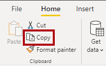

4. 要粘贴复制的视觉对象，请在“主页”功能区选项卡的“剪贴板”组中，选择“粘贴”  。

    提示：还可使用 Ctrl+C 和 Ctrl+V 快捷方式 。

    

5. 将新的表视觉对象移动到现有表视觉对象的右侧。
 
6. 选择新的表视觉对象，然后在“可视化效果”窗格的“值”井中，删除“Order Year”字段  。

    

7. 在“字段”窗格中，展开以打开 Ship Date 表 。

8. 要向新的表视觉对象添加新字段，请将 Ship Date 表中的“Ship Year”字段拖到“Sales Amount”字段上方的“值”井中   。

    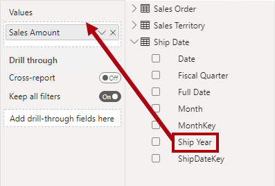

9. 验证新的表视觉对象是否显示按发货年份分组的销售额。

    

    该模型现在有两个日期表，其中每个都与 Sales 表具有活动关系。此设计方法的好处在于十分灵活。现在可以将所有度量值和可汇总字段与任一日期表一起使用。

    但也存在一些缺点。每个角色扮演表都会增加模型的大小，但维度表中的行数通常并不大。每个角色扮演表还需要复制模型配置，例如标记日期表、创建层次结构和其他设置。此外，额外的表可能会生成大量的字段。用户可能会发现更难找到其所需的模型资源。

    最后，不可能在一个视觉对象中实现筛选器的组合。例如，如果不创建度量值，就不可能在同一个视觉对象中将 Sales Ordered 与 Sales Shipped 合并。你将在下一个练习中创建该度量值。

## <a name="explore-other-relationship-functions"></a>探索其他关系函数

在本练习中，你将使用其他 DAX 关系函数。

### <a name="explore-other-relationship-functions"></a>探索其他关系函数

在此任务中，你将使用 CROSSFILTER 和 TREATAS 函数来修改计算期间的关系行为。

1. 在“字段”窗格的 Sales 表中，选择“Sales Shipped”度量值  。

    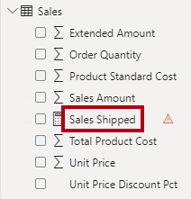

2. 在公式库中，将文本替换为以下定义：

    ```
    Sales Shipped =
    CALCULATE (
    SUM ( 'Sales'[Sales Amount] ),
    CROSSFILTER ( 'Date'[DateKey], 'Sales'[OrderDateKey], NONE ),
    TREATAS (
    VALUES ( 'Date'[DateKey] ),
    'Ship Date'[ShipDateKey]
        )
    )
    ```

    此公式使用 CALCULATE 函数通过修改后的关系行为对“Sales Amount”列求和。CROSSFILTER 函数禁用与“OrderDateKey”列的活动关系（此函数还可以修改筛选器方向）。TREATAS 函数通过将上下文中的“DateKey”值应用于“ShipDateKey”列来创建虚拟关系   。

3. 将修改后的“Sales Shipped”度量值添加到第一个表视觉对象。

    

4. 查看第一个表视觉对象。

    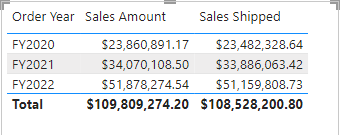

5. 请注意，没有 BLANK 组。

    由于“OrderDateKey”列中没有 BLANK，因此未生成 BLANK 组。显示未发货销售额将需要不同的方法。

### <a name="show-unshipped-sales"></a>显示未发货的销售额

在此任务中，你将创建用于显示未发货的销售额的度量值。

1. 使用以下定义创建名为“Sales Unshipped”的度量值：

    ```
    Sales Unshipped =
    CALCULATE (
    SUM ( 'Sales'[Sales Amount] ),
    ISBLANK ( 'Sales'[ShipDateKey] )
    )
    ```
    此公式对“ShipDateKey”列为空白的“Sales Amount”列求和 。

2. 将此度量值格式化为使用两位小数。

3. 要向页面添加新的视觉对象，请先选择报表页的空白区域。

4. 在“可视化效果”窗格中，选择“卡片”视觉对象图标 。

    

5. 将“Sales Unshipped”度量值拖到卡片视觉对象中。

    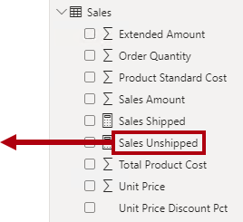

6. 验证最终报表页布局是否如下所示。

    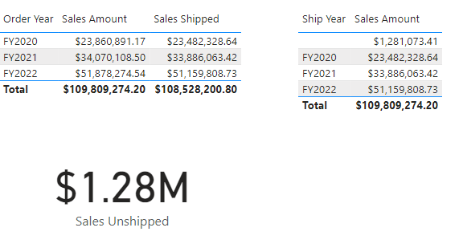

### <a name="finish-up"></a>完成

在此任务中，你将完成操作。

1. 保存 Power BI Desktop 文件。

    

2. 关闭 Power BI Desktop。