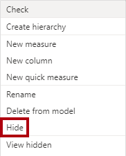
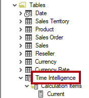

---
lab:
  title: 创建计算组
  module: Design and build tabular models
---
# 创建计算组

## 概述

预估完成本实验室需要 45 分钟

在此实验室中，你将使用 Power BI Desktop 和表格编辑器 2 创建计算组。

在此实验室中，你将了解如何完成以下操作：

-   创建计算组。
-   设置计算项的格式。
-   设置计算组的优先级。
-   将视觉对象配置为使用计算组。

## 入门
### 克隆本课程的存储库

1. 在“开始”菜单上，打开“命令提示符”

    

1. 在命令提示符窗口中，键入以下内容导航到 D 驱动器：

    `d:` 

   按 Enter。

    


1. 在命令提示符窗口中，输入以下命令以下载课程文件并将其保存到名为 DP500 的文件夹中。
    
    `git clone https://github.com/MicrosoftLearning/DP-500-Azure-Data-Analyst DP500`
   
1. 克隆存储库后，关闭命令提示符窗口。 
   
1. 在文件资源管理器中打开 D 驱动器，确保文件已下载。

## 准备环境

通过安装表格编辑器 2、设置 Power BI Desktop、查看数据模型和创建度量值，来准备实验室环境。

### 下载并安装表格编辑器 2

下载并安装表格编辑器 2 才能创建计算组。

重要提示：如果已在 VM 环境中安装了表格编辑器 2，请继续执行下一个任务。

表格编辑器是一个编辑器替代工具，可用于创作 Analysis Services 和 Power BI 的表格模型。表格编辑器 2 是一个开放源代码项目，可以在不访问模型中的任何数据的情况下编辑 BIM 文件。

1.  确保关闭 Power BI Desktop。

1.  在 Microsoft Edge 中，导航到表格编辑器发布页。

    ```https://github.com/TabularEditor/TabularEditor/releases```
    
1. 向下滚动到“资产”部分，然后选择 TabularEditor.Installer.msi 文件 。 该操作将启动文件安装。

1. 完成后，选择“打开文件”以运行安装程序。

    

1.  在“表格编辑器安装程序”窗口中，选择“下一步”。

    

1.  在“许可协议”步骤中，如果同意，请选择“我同意”，然后选择“下一步”  。

    

1.  在“选择安装文件夹”步骤中，选择“下一步” 。


2.  在“应用程序快捷方式”步骤中，选择“下一步” 。


3. 在“确认安装”步骤中，选择“下一步” 。

4. 如果看到“用户帐户控制”弹出窗口，请选择“是”。

5. 安装完成后，选择“关闭”。

    表格编辑器现已安装，并注册为 Power BI Desktop 外部工具。

### 设置 Power BI Desktop

现在，你将打开预先开发的 Power BI Desktop 解决方案。

1.  在文件资源管理器中，转到 D:\\DP500\\Allfiles\\07\\Starter 文件夹。

2.  若要打开预先开发的 Power BI Desktop 文件，请双击 Sales Analysis - Create calculation groups.pbix 文件。

3.  若要保存文件，请在“文件”功能区选项卡上，选择“另存为” 。

4.  在“另存为”窗口中，转到 D:\\DP500\\Allfiles\\07\\MySolution 文件夹 。

5.  选择“保存”。

6.  选择“外部工具”功能区选项卡。

    

7.  请注意，可以从此功能区选项卡启动表格编辑器。

    

    在下一个练习中，你将使用表格编辑器创建计算组。

### 查看数据模型

查看数据模型，以了解计算组将如何应用于此模型。

1.  在 Power BI Desktop 左侧，切换到“模型”视图。

    

2.  使用模型关系图查看模型设计。

    

    该模型包括七个维度表和两个事实数据表。Sales 事实数据表存储销售订单详细信息。Currency Rate 事实数据表存储多种货币的每日货币汇率。这是一种经典星型架构设计* *。

3.  切换到“报表”视图。

    

4.  在“数据”窗格（位于右侧）中展开 Sales 表，以查看字段 。

    

5.  请注意，两个 Sales 表字段用 sigma 符号 (∑) 修饰。

    sigma 符号表示字段将使用聚合函数（如 sum、count、average 或其他）自动汇总。

    但是，将计算组添加到模型时，必须禁用此自动行为。这意味着，只能通过使用数据分析表达式 (DAX) 公式定义的度量值来实现汇总。在下一个任务中，将向模型添加度量值。

### 创建度量值

创建三个与销售相关的度量值，为创建计算组做好准备。

1.  在“数据”窗格中，右键单击 Sales 表，然后选择“新建度量值”  。

    

2.  在编辑栏（位于功能区下方）中，将文本替换为以下度量值定义，然后按 Enter。

    提示：所有公式都可从 D:\\DP500\\Allfiles\\07\\Assets\\Snippets.txt 复制和粘贴。

    DAX

    ```Sales = SUM ( 'Sales'[Sales Amount] )```

3.  在“度量工具”上下文功能区中的“格式”组中，将小数位数设置为 2  。

    

4.  使用以下定义创建名为“成本”的第二个度量值，并以类似方式设置其格式：

    DAX

    ```Cost = SUM ( 'Sales'[Total Product Cost] )```

5.  使用以下定义创建名为“利润”的第三个度量值，并以类似方式设置其格式：

    DAX

    ```Profit = [Sales] - [Cost]```

6.  在“数据”窗格中，右键单击“Sales Amount”字段，然后选择“隐藏”  。

    

7.  同时隐藏“产品总成本”字段。

8.  请注意，现在 Sales 表首先列在“数据”窗格中，并使用多计算器图标进行修饰 。

    

    当表仅包含可见度量值时，它会显示在窗格顶部。这样，它的行为就类似于度量值组（多维模型的对象）。不要将表格模型的这种修饰表示形式与 DAX 计算组混淆。

## 创建计算组

现在，你将创建两个计算组。 第一个将支持时间智能。 第二个将支持币种转换。

### 创建时间智能计算组

使用表格编辑器创建时间智能计算组。 它将简化创建许多与时间相关的计算，包括 PY（上一年）、YoY（同比）和 YoY %（同比百分比）。 计算组支持使用不同的时间智能计算来分析任何度量值。

Power BI Desktop 不支持创建或管理计算组。

   > 提示：所有语法都可从 D:\DP500\Allfiles\07\Assets\Snippets.txt 复制和粘贴。

1.  在“外部工具”功能区上，选择“表格编辑器”。

    

    表格编辑器随即在新窗口中打开，并实时连接到 Power BI Desktop 中托管的数据模型。直到保存表格编辑器中对模型所做的更改，这些更改才会传播到 Power BI Desktop。

2.  在“表格编辑器”窗口的左侧窗格中，右键单击 Tables 文件夹，然后选择“新建”\>“计算组”  。

    

3.  在左侧窗格中，将默认名称替换为“时间智能”，然后按 Enter 。

4.  展开 Time Intelligence 表。

5.  选择“名称”列。

    

    计算组包含此单列，而数据行用于定义计算组。最好将列重命名，使其反映计算的对象。

6.  在“属性”窗格（位于右下角）中，选择“名称”属性，然后将其重命名为“时间计算”  。

    

7.  若要创建计算项，请右键单击 Time Intelligence 表，然后选择“新建”\>“计算项”  。

    

8.  在左侧窗格中，将默认名称替换为“当前”，然后按 Enter 。

9.  在“表达式编辑器”窗格（位于“属性”窗格上方）中，输入以下公式：

    DAX

    ```SELECTEDMEASURE ()```

    

    SELECTEDMEASURE 函数返回对计算项进行计算时当前在上下文中的度量值的引用。

10. 在“表达式编辑器”窗格工具栏中，选择第一个按钮以接受更改。

    

11. 使用以下公式创建名为 PY 的第二个计算项：

    DAX

    ```CALCULATE ( SELECTEDMEASURE (), SAMEPERIODLASTYEAR ( 'Date'[Date] ) )```

    上年度 (PY) 公式计算上一年所选度量值的值。

12. 使用以下公式创建名为 YoY 的第三个计算项：

    DAX
    ```
    SELECTEDMEASURE () 
        - CALCULATE ( SELECTEDMEASURE (), 'Time Intelligence'[Time Calculation] = "PY" )
    ```

    *同比 (YoY) 公式计算当年所选度量值与上一年的差值。*

13. 使用以下公式创建名为 YoY % 的第四个计算项：

    DAX
    ```
    DIVIDE (
        CALCULATE ( SELECTEDMEASURE (), 'Time Intelligence'[Time Calculation] = "YoY" ),
        CALCULATE ( SELECTEDMEASURE (), 'Time Intelligence'[Time Calculation] = "PY" )
    )
    ```
    *同比百分比 (YoY %) 公式计算所选度量与上一年相比的百分比变化。*

14. 在“属性”窗格中，将“格式字符串表达式”属性设置为 ： 
    ```
    "0.00%;-0.00%;0.00%"
    ```

    提示：格式字符串表达式可从 D:\\DP500\\Allfiles\\07\\Assets\\Snippets.txt 复制和粘贴。

    

15. 验证“时间智能”计算组是否包含四个计算项。

    

16. 若要保存对 Power BI Desktop 模型的更改，请在“文件”菜单上选择“保存” 。

    

    提示：也可以选择工具栏按钮或按 Ctrl+S**。

17. 切换到 Power BI Desktop。

18. 请注意报表设计器上方的黄色横幅。

    

19. 在横幅右侧，选择“立即刷新”。

    

    刷新通过将计算组创建为模型表来应用更改。然后，它将计算项加载为数据行。

20. 在“数据”窗格中，展开 Time Intelligence 表 。

    

### 更新矩阵视觉对象

现在，你将修改矩阵视觉对象，以使用“时间计算”列。

1.  在报表中，选择矩阵视觉对象。

2.  在“可视化效果”窗格的“值”井中，选择 X 以移除“销售额”字段   。

    

3.  在“数据”窗格的 Sales 表中，将“Sales”字段拖到“值”井中   。

    

4.  在“数据”窗格的 Time Intelligence 表中，将“Time Calculation”字段拖到“列”井中   。

    

5.  验证矩阵视觉对象是否显示按月份分组的与时间相关的“销售额”度量值网格。

    

    值的格式派生自所选度量值。但是，请回想一下，你为 YoY % 度量值设置了格式字符串表达式，用于生成百分比格式**。

### 创建币种转换计算组

现在，你将创建币种转换计算组。 它可灵活地将 Sales 表度量值转换为所选货币。 它还将为所选货币应用适当的格式。

1.  在 Power BI Desktop 中切换到“数据”视图。

    

2.  在“数据”窗格中，选择 Currency 表 。

3.  请注意，包含格式字符串表达式的 FormatString 隐藏列是列值。

    

    将使用 DAX 表达式来应用所选货币的格式字符串。

4.  切换到表格编辑器。

5.  创建名为“币种转换”的计算组。

    由于任务是重复的，因此提供的说明较简短。如有必要，可参考本练习的第一个任务中的步骤。

    

6.  将“名称”列重命名为“转换后的货币” 。

    

7.  使用以下公式创建名为“币种转换”的计算项：

    DAX
    ```
    IF (
        HASONEVALUE ( 'Currency'[Currency] ),
        SUMX (
            VALUES ( 'Date'[Date] ),    CALCULATE (
                DIVIDE ( SELECTEDMEASURE (), MAX ( 'Currency Rate'[EndOfDayRate] ) )
            )
        )
    )
    ```
    当筛选器上下文中只有一种货币时，该公式对所选度量值的每日值求和，这些每日值将会除以当日收盘汇率。

8.  在“属性”窗格中，将“格式字符串表达式”属性设置为以下公式：

    DAX
    ```
    SELECTEDVALUE ( 'Currency'[FormatString] )
    ```
    此公式返回所选货币的格式字符串。 这样，就可以由 Currency 维度表中的数据动态地驱动格式设置。

9.  保存对 Power BI Desktop 模型的更改。

10. 切换到 Power BI Desktop 并刷新更改。

    

11. 切换到“报表”视图。

    

12. 选择矩阵视觉对象。

13. 在“数据”窗格中的 Currency Conversion 表中，将“Converted Currency”字段拖到“筛选器”窗格中，然后拖到此视觉对象组上的“筛选器”中    。

    

14. 在筛选器卡中，检查“币种转换”值。

    

15. 请注意，值格式会更新，以清楚地描述美元金额。

    

16. 在“货币”切片器中，选择其他货币，然后在矩阵视觉对象中，注意更新后的值和格式。

17. 将“货币”切片器还原回“美元”。

    

18. 但是，请注意，YoY % 值不再是百分比。

    有一个问题是时间智能和币种转换计算组均已应用，但计算顺序不正确。目前，会进行 YoY% 计算，然后币种转换将添加当月的每日计算结果。若要生成正确的结果，必须反转计算顺序。可以通过设置优先级值来控制计算顺序*  *。

### 修改计算组的优先级

现在，将修改两个计算组的计算组优先级。

1.  切换到表格编辑器。

2.  在左窗格中，选择时间智能计算组。

    

3.  在“属性”窗格中，将“计算组优先级”属性设置为 20。

    

    值越高，应用程序优先级越高。因此，首先应用优先级较高的计算组。

4.  将“币种转换”计算组的计算组优先级设置为 10。

    

    这些配置将确保稍后会进行“时间智能”计算**。

5.  保存对 Power BI Desktop 模型的更改。

6.  切换到 Power BI Desktop。

7.  请注意，YoY % 值现在是百分比。

    

### 完成

在此任务中，你将完成操作。

1.  保存 Power BI Desktop 文件。

    

2.  关闭 Power BI Desktop。

3.  关闭表格编辑器。
