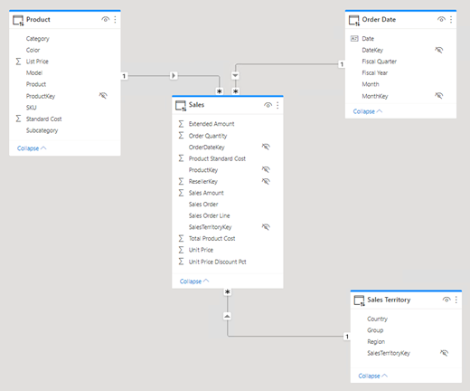
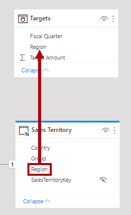
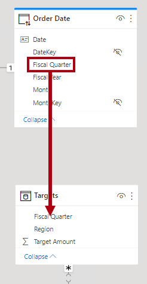
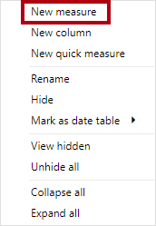
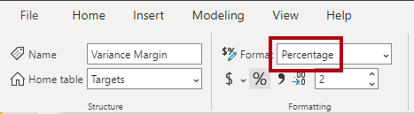

---
lab:
  title: 创建复合模型
  module: Design and build tabular models
---

# 创建复合模型

## 概述

完成本实验室预计需要 30 分钟。

在本实验室中，通过将表添加到预先开发的 DirectQuery 模型来创建复合模型。

在此实验室中，你将了解如何完成以下操作：

- 创建复合模型。

- 创建模型关系。

- 创建度量值。

## 入门

在本练习中，需要准备好环境。

### 克隆本课程的存储库

1. 在“开始”菜单上，打开“命令提示符”

    

1. 在命令提示符窗口中，键入以下内容导航到 D 驱动器：

    `d:` 

   按 Enter。

    


1. 在命令提示符窗口中，输入以下命令以下载课程文件并将其保存到名为 DP500 的文件夹中。
    
    `git clone https://github.com/MicrosoftLearning/DP-500-Azure-Data-Analyst DP500`
   
1. 克隆存储库后，关闭命令提示符窗口。 
   
1. 在文件资源管理器中打开 D 驱动器，确保文件已下载。

### 设置 Power BI Desktop

在此任务中，你将打开预先开发的 Power BI 模板文件。

1. 若要打开文件资源管理器，请选择任务栏上的文件资源管理器快捷方式。

2. 转到 D:\DP500\Allfiles\08\Starter 文件夹。

3. 若要打开预先开发的 Power BI Desktop 文件，请双击“Sales Analysis - Create a composite model.pbit”文件。 

4. 出现批准潜在安全风险的提示时，请选择“确定”。

5. 输入如下所示的 SQLServerInstance、SqlServerDatabase 和 Culture。 选择“加载”。

    SqlServerInstance = ```localhost```

    SqlServerDatabase = ```AdventureWorksDW2022-DP500```

    Culture = ```en```

    

6. 在 SQL Server 数据库连接提示符下，选择“连接”。

7. 在“加密支持”窗口中，选择“确定”。

8. 在“原生数据库查询”窗口中，选择“运行”。

9. 保存文件。 在“文件”菜单中，选择“另存为” 。

10. 在“另存为”窗口中，转到 D:\DP500\Allfiles\08\MySolution 文件夹 。 文件名为“Sales Analysis - Create a composite model.pbix”。

11. 选择“保存”。

### 查看报表

在此任务中，你将查看预先开发的报表。

1. 在 Power BI Desktop 状态栏右下角，请注意存储模式为 DirectQuery。

    

    DirectQuery 模型包含使用 DirectQuery 存储模式的表。使用 DirectQuery 存储模式的表将查询传递到基础数据源。数据建模者经常使用这种存储模式对大量数据进行建模。在这种情况下，基础数据源为 SQL Server 数据库。

1. 查看报表设计。

    

    此报表页有一个标题和两个视觉对象。利用切片器视觉对象可按一个会计年度筛选，而柱形图视觉对象显示季度销售额。你将通过向柱形图视觉对象添加销售目标来改进此设计。

1. 在“Fiscal Year”切片器中，选择“FY2021” 。

    

    务必要了解切片器选择会更改应用于柱形图视觉对象的筛选器。Power BI 刷新柱形图视觉对象。这涉及从源数据库中检索数据。这样，柱形图视觉对象会显示最新的源数据。（可能会出现一些报表级别的缓存，这意味着报表可能会重用以前查询的数据。）

### 查看数据模型

在此任务中，你将查看预先开发的数据模型。

1. 切换到“模型”视图。

    

1. 使用模型图查看模型设计。

    

    模型包括三个维度表和一个事实数据表。Sales 事实数据表表示销售订单详细信息。这是一种经典星型架构设计。每个表顶部的栏表示它使用 DirectQuery 存储模式。因为每个表都有一个蓝色栏，表示所有表都属于同一源组**。

    你将使用另一个事实数据表扩展模型，以支持分析销售目标事实。

## 创建复合模型

在本练习中，你将添加一个将 DirectQuery 模型转换为复合模型的导入表。

*复合模型包含多个源组。*

### 添加表

在此任务中，你将添加一个表，用于存储源自 Excel 工作簿的销售目标。

1. 在“主页”功能区选项卡上的“数据”组中，选择“Excel 工作簿”  。

    

1. 在“打开”窗口中，转到 D:\DP500\Allfiles\08\Assets 文件夹 。

1. 选择 SalesTargets.xlsx 文件。

    

1. 选择“打开”。

    

1. 在“导航器”窗口中，检查 Targets 表 。

    

1. 在预览窗格（位于右侧）中，请注意该表包含三列，表的每一行分别表示会计季度、销售区域和目标销售额。

    

    你将导入此数据以将表添加到 DirectQuery 模型。由于无法使用 DirectQuery 连接到 Excel 工作簿，Power BI 将导入它。

1. 选择“转换数据”。

    

1. 在 Power Query 编辑器窗口中，若要重命名第一列，请双击 Period 列标题。

1. 将该列重命名为 Fiscal Quarter，然后按 Enter 。

    

1. 若要修改第三列的数据类型，在 Target Amount 列标题中，选择数据类型图标 (123)，然后选择“定点小数” 。

    

1. 若要应用查询，请在“主页”功能区选项卡上的“关闭”组内，选择“关闭与应用”图标。

    

1. 出现存在潜在安全风险的提示时，请阅读消息，然后选择“确定”。

    

1. 在 Power BI Desktop 中，加载过程完成后，在模型图中，将新表直接放在 Order Date 表下方。

    表可能超出视图范围。如果是这种情况，请水平滚动以显示该表。

    

1. 请注意，Targets 表顶部没有蓝色栏。

    缺少此栏表示表属于导入源组。

### 创建模型关系

在此任务中，你将创建两种模型关系。

1. 若要创建关系，请将 Sales Territory 表中的 Region 列拖放到 Targets 表的 Region 列上   。

    

1. 在“创建关系”窗口中，请注意“基数”下拉列表设置为“一对多”  。

    Sales Territory 表中的 Region 列包含唯一值，而 Targets 表中的 Region 列包含重复值。这种一对多的基数在维度表和事实数据表之间的关系中很常见*   *。

1. 选择“确定”。

    

1. 在模型图中，请注意 Sales Territory 和 Target 表之间现在存在一种关系 。

1. 另请注意，关系线看起来与其他关系线不同。

    

    “断开”线表示关系为有限关系。当没有保证的“一方”时，模型关系就是有限的。在这种情况下，这是因为关系跨越了源组。在查询时，有限关系的关系评估可能会有所不同。有关详细信息，请参阅[有限关系](https://docs.microsoft.com/power-bi/transform-model/desktop-relationships-understand)。

1. 创建另一个关系，这次将 Order Date 表的 Fiscal Quarter 列与 Targets 表的 Fiscal Quarter 列相关联   。

    

1. 在“创建关系”窗口中，请注意“基数”下拉列表设置为“多对多”  。

    由于两列都包含重复值，Power BI Desktop 会自动将基数设置为多对多。但默认的交叉筛选器方向不正确。

1. 在“交叉筛选器方向”下拉列表中，选择“单一(Order Date 筛选 Targets)” 。

    

    维度表筛选事实数据表很常见。在此模型设计中，没有必要（或者说不能有效地）将筛选器从事实数据表传播到维度表。

1. 选择“确定”。

    

### 设置模型属性

在此任务中，将设置新表的模型属性。

1. 在 Targets 表中，选择 Fiscal Quarter 列 。

1. 在按住 Ctrl 键的同时选择 Region 列 。

1. 在“属性”窗格中，将“已隐藏”属性设置为“是”。

    

1. 在 Targets 表中，选择 Target Amount 列 。

1. 在“属性”窗格的“格式设置”部分中，将“小数位数”属性设置为“2”   。

    

### 添加度量值

在此任务中，你将添加两个度量值，用于分析销售目标差异。

1. 切换到“报表”视图。

    

1. 若要创建度量值，请在“数据”窗格（位于右侧）中右键单击 Targets 表，然后选择“新建度量值”  。

    

1. 在编辑栏中，输入以下度量值定义。

    提示：所有度量值定义都可从 D:\DP500\Allfiles\08\Assets\Snippets.txt 文件复制和粘贴。


    ```
    Variance = SUM ( 'Sales'[Sales Amount] ) - SUM ( 'Targets'[Target Amount] )
    ```


    名为 Variance 的度量值从 Sales Amount 的总和中减去 Target Amount 的总和*  *。

1. 在“度量工具”上下文功能区选项卡上的“格式设置”组内的小数位框中，输入“2”  。

    

1. 使用以下度量值定义创建另一个度量值。


    ```
    Variance Margin =

    DIVIDE (

    [Variance],

    SUM ( 'Targets'[Target Amount] )

    )
    ```


    名为 Variance Margin 的度量值用 DAX [DIVIDE](https://docs.microsoft.com/dax/divide-function-dax) 函数将 Variance 度量值除以 Target Amount 列的总和*  *。

1. 在“度量工具”上下文功能区选项卡上的“格式设置”组内的“格式”下拉列表中，选择“百分比”   。

    

1. 在“数据”窗格的 Targets 表中，验证是否有两个度量值 。

    

### 更新报表布局

在此任务中，你将更新报表以使用新度量值。

1. 在报表中，选择柱形图视觉对象。

1. 在“数据”窗格中，将“Target Amount”字段拖到“可视化效果”窗格中，在“值”井内直接拖放到“Sales Amount”字段下方    。

    

1. 请注意，柱形图视觉对象现在显示销售额和目标金额。

1. 将这两个度量值拖到“工具提示”井中。

    

1. 将光标悬停在任何列上以显示工具提示，并注意到它显示度量值。

    

    现在已创建完组合 DirectQuery 和导入表的复合模型。可通过将维度表设置为使用双存储模式并添加聚合来优化模型以提高查询性能。但这些增强功能是其他实验室的学习目标。

### 完成

在此任务中，你将完成操作。

1. 保存 Power BI Desktop 文件。

    

1. 关闭 Power BI Desktop。
