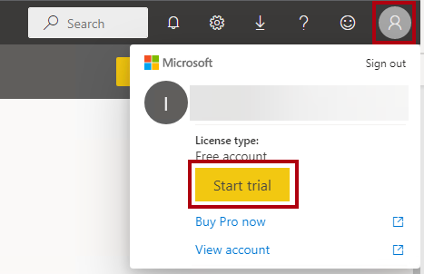
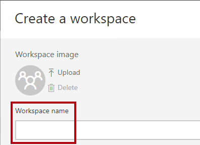
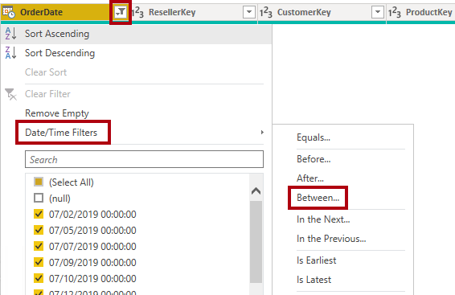
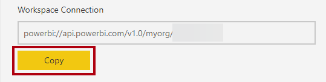
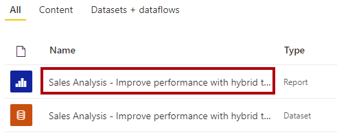
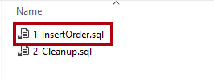
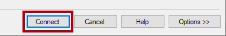

---
lab:
  title: 使用混合表提高性能
  module: Optimize enterprise-scale tabular models
---

# 使用混合表提高性能

## 概述

**预估完成本实验室需要 45 分钟**

在此实验室中，将设置增量刷新并启用 DirectQuery 分区来提供实时更新并提高刷新和查询性能。

在此实验室中，你将了解如何完成以下操作：

- 设置增量刷新。

- 查看表分区。

## 入门

在本练习中，需要准备好环境。

### 克隆本课程的存储库

1. 在“开始”菜单上，打开“命令提示符”。

    

1. 在“命令提示符”窗口中，键入以下内容导航到 D 驱动器：

    `d:` 

   按 Enter。

    

1. 在命令提示符窗口中，输入以下命令以下载课程文件并将其保存到名为 DP500 的文件夹中。
    
    `git clone https://github.com/MicrosoftLearning/DP-500-Azure-Data-Analyst DP500`
   
1. 克隆存储库后，在文件资源管理器中打开 D 驱动器，以确保文件已下载。 “关闭命令提示符”窗口。

### 部署 Azure SQL 数据库 

在此任务中，你将创建一个 Azure SQL 数据库，该数据库将用作 Power BI 的数据源。 运行安装脚本就会创建 Azure SQL 数据库服务器并加载 AdventureWorksDW2022 数据库。

1. 若要打开“文件资源管理器”，请选择任务栏上的“文件资源管理器”快捷方式。

    

2. 转到 D:\DP500\Allfiles\10 文件夹。

3. 双击以打开 setup2.ps1 文件脚本。
    - 如果有兴趣了解脚本正在设置的资源，请在记事本中阅读该脚本。 以 # 开头的行表示脚本正在执行的操作。
    - 关闭脚本。

5. 在任务栏上的搜索框中，键入 `PowerShell`.  
   
   当搜索结果出现时，选择“以管理员身份运行”
    
    
    
    如果出现提示，请选择“是”以允许此应用对设备进行更改。
1. 在 PowerShell 中，输入以下 2 行文本以运行脚本。 
    
    ` cd D:\DP500\Allfiles\10`

    按 **Enter**。

    `.\setup2.ps1`
    
    按 **Enter**

    

2. 出现提示时，输入 Azure 帐户用户名、密码资和源组名称  。 按 **Enter**。 

    

    该脚本大约需要 10-15 分钟的运行时间。

    注意：此实验室要求资源组创建 Azure SQL 数据库。如果在托管实验室环境中没有提供的资源组，请在 Azure 订阅中[创建资源组](https://docs.microsoft.com/azure/azure-resource-manager/management/manage-resource-groups-portal#create-resource-groups)。
3. 脚本完成后，关闭 PowerShell 窗口。

### 设置 Azure SQL 数据库

在此任务中，将设置 Azure SQL 数据库，以便从虚拟机的 (VM) IP 地址建立连接。 输入用户名、密码和资源组后，此脚本大约需要 10 分钟才能运行。

1. 在 Web 浏览器中，转到 https://portal.azure.com。

2. 如果系统提示进行演示，请选择“也许稍后”。

    

3. 选择“SQL 数据库”磁贴。

    

4. 在 SQL 数据库列表中，选择 AdventureWorksDW2022-DP500 数据库。

5. 在“概述”选项卡上的操作栏中，选择“设置服务器防火墙”。

    

6. 在“公共访问”选项卡上选择“所有网络”。

7. 选择“添加客户端 IPv4 地址”。

    

7. 选择“保存”。

    

8. 使 Azure 门户 Web 浏览器会话保持打开状态。 需要在“设置 Power BI Desktop任务”中复制数据库连接字符串。

### 设置 Power BI 服务

在此任务中，你将登录到 Power BI 服务并启动试用许可证。

重要说明：如果已在 VM 环境中设置 Power BI，请继续执行下一个任务。

1. 在 Web 浏览器中，转到 https://powerbi.com。

2. 使用实验室凭据完成登录过程。

3. 在右上角选择“个人资料”图标，然后选择“开始试用”。

    

4. 出现提示时，选择“开始试用”。

    

    需要 Power BI Premium Per User (PPU) 才能完成本实验室。有试用许可证即可。

5. 执行所有剩余任务以完成试用设置。

    提示：Power BI Web 浏览器体验称为 Power BI 服务**。

### 创建工作区

在此任务中，你将创建一个工作区。

1. 若要在 Power BI 服务中创建工作区，请在“导航”窗格中（位于左侧）选择“工作区”，然后选择“创建工作区”  。

    

2. 在“创建工作区”窗格（位于右侧）的“工作区名称”框中，输入工作区的名称 。

    工作区名称在租户内必须唯一

    

3. 在“说明”框下方，展开“高级”部分。 

    

4. 将“许可证模式”选项设置为“Premium Per User” 。

    

    Power BI 仅支持高级工作区中的增量刷新和混合表。

5. 选择“保存”。

    

    创建后，Power BI 服务将打开工作区。稍后将在此实验室中返回到此工作区。

### 设置 Power BI Desktop

在此任务中，你将打开预先开发的 Power BI Desktop 解决方案，设置数据源设置和权限，然后刷新数据模型。

1. 若要打开“文件资源管理器”，请选择任务栏上的“文件资源管理器”快捷方式。

    

2. 转到 D:\DP500\Allfiles\10\Starter 文件夹。

3. 若要打开预先开发的 Power BI Desktop 文件，请双击“ Sales 分析 - 使用混合表.pbix 文件提高性能。

4. 若要编辑数据库数据源，请在“主页”功能区选项卡上的“查询”组中，选择“转换数据”下拉列表，然后选择“数据源设置”。   

    

5. 在“数据源设置”窗口中，选择“更改源”。 

    

6. 在“SQL Server 数据库”窗口中的“服务器”框中，将文本替换为实验室 Azure SQL 数据库服务器。  这位于 SQL Azure 门户 SQL 数据库中。

    

7. 选择“确定”。

    

8. 选择“编辑权限”。

    

9. 若要编辑数据库凭据，在“编辑权限”窗口中选择“编辑”。 

    

10. 在“SQL Server数据库”窗口中，输入 SQL Server 数据库用户名和密码并保存。 

    用户名：`sqladmin`

    密码：`P@ssw0rd01`

    

11.  选择“确定”。
    

12. 在“数据源设置”窗口中，选择“关闭”。 

    

13. 在“主页”功能区选项卡上，选择“查询”组中的“刷新”  。

    

14. 请等待数据刷新完成。

15. 若要保存文件，请在“文件”功能区选项卡上，选择“另存为” 。

16. 在“另存为”窗口中，转到 D:\DP500\Allfiles\10\MySolution 文件夹 。

17. 选择“保存”。

18. 如果尚未登录，请在 Power BI Desktop 右上角选择“登录”。 使用实验室凭据完成登录过程。

    重要说明：必须使用登录 Power BI 服务的相同凭据。

    

### 查看报表

在此任务中，你将查看预先开发的报表。

1. 在 Power BI Desktop 中，查看报表设计。

    

    报表页有一个标题和两个视觉对象。切片器视觉对象允许按单个会计年度进行筛选，而条形图视觉对象显示每月销售额。在此实验室中，你将通过设置增量刷新和混合表来提高报表的性能。

### 查看数据模型

在此任务中，你将查看预先开发的数据模型。

1. 切换到“模型”视图。

    

2. 使用模型图查看模型设计。

    

    该模型包括五个维度表和一个事实数据表。每个表都使用导入存储模式。Sales 事实数据表表示销售订单详细信息。这是一种经典星型架构设计。**

    在此实验室中，将设置销售表以使用增量刷新，并将其制成混合表。混合表包含表示最新时间段的 DirectQuery 分区。该分区可确保数据源中的当前数据在 Power BI 报表中可用。**

## 设置增量刷新

在本练习中，你将设置增量刷新。

增量刷新为经常加载新数据和更新数据的数据集表提供自动分区创建和管理，来扩展计划的刷新操作。这有助于减少刷新时间，降低源数据和 Power BI 的负担。还可以帮助更快地将当前数据呈现到 Power BI 报表。

### 添加参数

在此任务中，将添加两个参数。

1. 若要打开“Power Query 编辑器”窗口，请在“主页”功能区选项卡上的“查询”组内，单击“转换数据”图标  。

    

2. 在“Power Query 编辑器”窗口中的“查询”窗格中，选择“Sales”查询 。

    

3. 在预览窗格中，请注意 OrderDate 列，该列是日期/时间列。

    增量刷新要求表包含日期/时间或整数数据类型的日期列，其值的格式为 yyyymmdd。

    若要设置增量刷新，必须创建参数，Power BI 将用该参数筛选此列以创建表分区。

4. 若要创建参数，请在“主页”功能区选项卡上，选择“管理参数”图标。 

    

5. 在“管理参数”窗口中，选择“新建” 

    

6. 在“名称”框中，将文本替换为 RangeStart 。

7. 在“类型”下拉列表中选择“日期/时间”。 

8. 在“当前值”框中输入 6/1/2022（2022 年 6 月 1 日 - VM 使用美国日期格式）。  

    请注意，对于非 MM-DD-YYYY 格式位置，日期应输入为 1/6/2022

    设置参数时，可以使用任意值。Power BI 会在创建和管理分区时更新参数值。在此实验室中，你将为 2022 年 6 月设定一个范围。

    

9. 若要创建第二个参数，请选择“新建”。

10. 设置以下参数属性：

    - 名称：RangeEnd

    - 类型：日期/时间

    - 当前值：7/1/2022（2022 年 7 月 1 日）

     请注意，对于非 MM-DD-YYYY 格式位置，日期应输入为 1/7/2022

    

11. 选择“确定”。

    

###  筛选查询

在此任务中，你将向 Sales 查询添加筛选器。

1. 在“查询”窗格中，选择 Sales 查询。 

2. 在 OrderDate 列的标题中，选择向下箭头，然后选择“日期/时间筛选器” > “两者之间”。  

    

3. 在“筛选器行”窗口中，选择第一个日历图标下拉列表，然后选择参数。 

    

4. 在相邻的下拉列表中，请注意已设置 RangeStart 参数。

    默认参数选择是正确的。

5. 在第二个 range 下拉列表中，选择“早于”。

    

6. 在相应的下拉列表中，选择 RangeEnd 参数。

    

7. 选择“确定”。

    

8. 在“主页”功能区选项卡的“关闭”组内，单击“关闭并应用”图标。  

    

9. 请注意，Power BI Desktop 已将 5,134 行加载到 Sales 表中。

    

    这些是 2022 年 6 月的筛选行。

10. 保存 Power BI Desktop 文件。

    

### 设置增量刷新

在此任务中，将为 Sales 表设置增量刷新策略。

1. 在模型图中，右键单击 Sales 表标题，然后选择“增量刷新” 。

    

2. 在“增量刷新和实时数据”窗口中，在步骤 2 中打开增量刷新。

    

3. 设置以下内容：刷新日期前 2 年开始存档数据。

    

    此设置确定历史记录时期。在此实例中，Power BI 将为历史数据创建两个全年分区。

4. 设置以下内容：从刷新日期前 7 天开始增量刷新数据。

    

    这个设置确定了增量刷新周期，日期/时间在此周期内的所有行都包含在刷新分区中，并在执行每次刷新操作时刷新。

5. 在步骤 3 中，选中“使用 DirectQuery 实时获取最新数据”选项。

    

    超出增量刷新周期后，此设置可让人使用 DirectQuery 从数据源的所选表提取最新更改。所有晚于增量刷新周期的日期/时间行都包含在 DirectQuery 分区中，并通过每个数据集查询从数据源中提取这些行。此设置令表成为混合表，因为它将包含导入分区和一个 DirectQuery 分区。

6. 选择“应用”。

    

7. 保存 Power BI Desktop 文件。

    

### 发布数据集

在此任务中，你将发布数据集。

1. 若要发布报表，请在“主页”功能区选项卡上，选择“发布”。 

    

2. 在“发布到 Power BI”窗口中，选择在此实验室中创建的工作区，然后选择“选择”。

    

3. 发布成功后，选择“知道了”。

    

4. 关闭 Power BI Desktop。

5. 当系统提示选择是否保存更改时，请选择“保存”。

    

### 设置数据集

在此任务中，你将设置数据源凭据并刷新数据集。

1. 切换到 Power BI 服务 Web 浏览器会话。

2. 在工作区登陆页中，找到报表和数据集。

    

3. 将光标悬停在数据集上，出现省略号时，选择省略号，然后选择“设置”。

    

4. 在“数据源凭据”部分，选择“编辑凭据”链接 。

    

5. 在窗口中输入用户名和密码，并将隐私级别设置为“组织”。
       
    用户名：`sqladmin`

    密码：`P@ssw0rd01`

    

6. 选择“登录”。

    

8. 展开“计划刷新和性能优化”部分。

    

9. 但请注意，不要更改任何设置。

    在实际设置中，计划数据刷新，以便 Power BI 定期刷新和管理分区。

    在此实验室中，你将进行按需刷新。

10. 在“导航”窗格（位于左侧）中，选择工作区。

11. 在“工作区登陆”页中，将光标悬停在数据集上，然后选择“刷新”图标。

    

12. 在“刷新”列中，请注意旋转图标，并等它停止（指示刷新已完成）。

    

13. 要打开工作区设置，请在右上角选择“设置”。

    

14. 在“设置”窗格中，选择“高级”选项卡。 

    

15. 若要将工作区连接复制到剪贴板，请选择“复制”。

    

    你将使用工作区连接，以便在 SQL Server Management Studio (SSMS) 中连接到它。

16. 要关闭窗格，请选择“取消”。

    

### 查看表分区

在此任务中，你将使用 SSMS 查看表分区。

1. 若要打开 SSMS，请在任务栏上选择 SSMS 快捷方式。

    

2. 在“连接到服务器”窗口的“服务器类型”下拉列表中，选择“分析服务”。  

    

    可以使用 SSMS 通过 XMLA 读/写终结点连接到工作区。该终结点仅适用于高级工作区。

3. 在“服务器名称”框中，将文本粘贴到工作区连接中（按 Ctrl+V 键）以进行替换。 

4. 在“身份验证”下拉列表中，选择“Azure Active Directory - 密码”。 

5. 输入你的实验室凭据。

6. 选择“连接”。

    

7. 在对象资源管理器（位于左侧）中，依次展开 Databases 文件夹、Sales Analysis... 数据库（数据集）和 Tables 文件夹。  

    

8. 右键单击 Sales 表，然后选择“分区”。 

    

9. 在“分区”窗口中，请注意两年历史记录的分区列表，后跟季度分区和每日分区。

10. 滚动到列表底部，注意最后一个是当前和将来日期的 DirectQuery 分区。

    Power BI 会自动创建和管理所有这些分区。

11. 选择“取消”  。

    

## 测试混合表

在本练习中，你将打开报表，添加销售订单，然后查看报表数据更新。

### 打开报表

在此任务中，你将打开报表。

1. 切换到 Power BI 服务 Web 浏览器会话。

2. 在工作区登陆页中，选择报表。

    

3. 如果需要，在会计年度切片器中，选择包含当前月份（基于今天的日期）的会计年度。

    当前月份应显示为条形图中的条形。

    请注意，2022 年 8 月开始不属于 2022 财年，这是切片器的默认值。

### 向数据库添加一个订单

在此任务中，你将向数据库添加一个订单。

1. 切换到 SSMS。

2. 若要打开脚本文件，请在“文件”菜单上选择“打开” > “文件”  。

3. 在“打开文件”窗口中，转到 D:\DP500\Allfiles\10\Assets 文件夹 。

4. 选择 1-InsertOrder.sql 文件，然后选择“打开”。 

    

5. 在“连接到数据库引擎”窗口中，确保“服务器名称”下拉列表设置为实验室 Azure SQL 数据库服务器 。

6. 在“身份验证”下拉列表中，选择“SQL Server 身份验证” 。

7. 输入用户名 sqladmin 和密码。

8. 选择“连接”。

    

9. 查看脚本。

    此脚本把今天作为订单日期，将单个订单插入 FactInternetSales 表中。**

10. 若要运行脚本，请在工具栏上选择“执行”（或按 F5） 。

    

11. 若要关闭文件，请在“文件”菜单上选择“关闭” 。

### 刷新报表

在此任务中，你将刷新报表。

1. 切换到 Power BI 服务 Web 浏览器会话。

2. 在报表中，记下本月的销售额。

3. 在操作栏上，选择“刷新”命令。

    

4. 报表刷新完成后，验证当前月份的销售额是否增加了 10,000 美元。

    Power BI 查询 Sales 表时，它从 DirectQuery 分区中检索当前数据，该分区直接查询 Azure SQL 数据库。**

    提示：混合表特别适用于自动页面刷新，这是自动刷新 Power BI 报表的功能。

### 完成

在此任务中，你将完成操作。 打开 SSMS 并确保已连接到数据库 AdventureWorksDW2022-DP500。

1. 在 SSMS 中，打开 2-Cleanup.sql 文件。

    

    此脚本将删除插入的订单。

2. 运行该脚本。

3. 关闭 SSMS。
