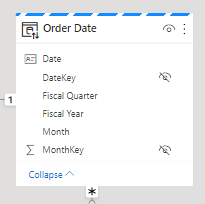
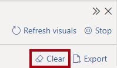
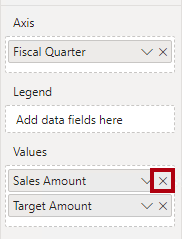

---
lab:
  title: 使用双存储模式提高查询性能
  module: Optimize enterprise-scale tabular models
---

# 使用双存储模式提高查询性能

## 概述

完成本实验室预计需要 30 分钟

在本实验室中，通过将一些表设置为使用双存储模式来提高复合模型的性能。

在此实验室中，你将了解如何完成以下操作：

- 设置双存储模式。

- 使用性能分析器查看刷新活动。

## 入门

在本练习中，需要准备好环境。

### 克隆本课程的存储库

1. 在“开始”菜单上，打开“命令提示符”

    

1. 在命令提示符窗口中，键入以下内容导航到 D 驱动器：

    `d:` 

   按 Enter。

    

1. 在命令提示符窗口中，输入以下命令以下载课程文件并将其保存到名为 DP500 的文件夹中。
    
    `git clone https://github.com/MicrosoftLearning/DP-500-Azure-Data-Analyst DP500`
   
1. 克隆存储库后，关闭命令提示符窗口。 
   
1. 在文件资源管理器中打开 D 驱动器，确保文件已下载。

### 设置 Power BI Desktop

在此任务中，你将打开预先开发的 Power BI Desktop 解决方案。

1. 若要打开文件资源管理器，请选择任务栏上的文件资源管理器快捷方式。

2. 转到 D:\DP500\Allfiles\11\Starter 文件夹。

3. 若要打开预先开发的 Power BI Desktop 文件，请双击“Sales Analysis - Improve query performance with dual storage mode.pbix”文件。

4. 出现存在潜在安全风险的提示时，请阅读消息，然后选择“确定”。

5. 出现批准运行原生数据库查询的提示时，请选择“运行”。

6. 若要保存文件，请在“文件”功能区选项卡上，选择“另存为” 。

7. 在“另存为”窗口中，转到 D:\DP500\Allfiles\11\MySolution 文件夹 。

8. 选择“保存”。

### 查看报表

在此任务中，你将查看预先开发的报表。

1. 在 Power BI Desktop 状态栏右下角，请注意存储模式为混合。

    

    混合模型包含来自不同源组的表。此模型包含一个从 Excel 工作簿获取数据的导入表。其余表使用 DirectQuery 连接到 SQL Server 数据库，即数据仓库。

2. 查看报表设计。

    

    此报表页有一个标题和两个视觉对象。利用切片器视觉对象可按一个会计年度筛选，而柱形图视觉对象显示季度销售额和目标金额。通过将一些表设置为使用双存储模式来提高报表的性能。

### 查看数据模型

在此任务中，你将查看预先开发的数据模型。

1. 切换到“模型”视图。

    

2. 使用模型图查看模型设计。

    

    模型包括三个维度表和两个事实数据表。Sales 事实数据表表示销售订单详细信息，而 Targets 表表示季度销售目标。这是一种经典星型架构设计。其中一些表顶部的栏表示使用 DirectQuery 存储模式。每个具有蓝色栏的表都属于同一源组* *。

    在本实验室中，你将把一些表设置为使用双存储模式。

## 设置双存储模式

在本练习中，你将设置双存储模式。

使用双存储模式的模型表同时使用导入和 DirectQuery 存储模式。Power BI 根据各个查询确定要使用的最有效存储模式，尽可能使用导入模式，因为它更快。

### 使用性能分析器

在此任务中，你将打开性能分析器，并用它来检查刷新事件。

1. 切换到“报表”视图。

    

2. 若要检查视觉对象刷新事件，请在“视图”功能区选项卡上的“显示”窗格组内选择“性能分析器”  。

    

3. 在“性能分析器”窗格（位于“可视化效果”窗格左侧）中，选择“开始记录”  。

    

    性能分析器检查并显示更新或刷新视觉对象所需的时间。每个视觉对象都至少向源数据库发出一个查询。有关详细信息，请参阅[使用性能分析器检查报表元素性能](https://docs.microsoft.com/power-bi/create-reports/desktop-performance-analyzer)。

4. 选择“刷新视觉对象”。

    

5. 在“性能分析器”窗格中，展开“切片器”视觉对象，并注意直接查询事件 。

    

    每当看到直接查询事件时，就能知道 Power BI 使用 DirectQuery 存储模式从源数据库中检索数据。

6. 展开“按会计季度显示销售结果”视觉对象，注意它还记录了直接查询事件。

    

    你总是用同一个表中的一个或多个字段来设置切片器视觉对象。无法使用不同表中的字段来设置切片器。此外，切片器几乎总是使用维度表中的字段。因此，若要提高切片器视觉对象的查询性能，请确保其存储导入的数据。在这种情况下，由于维度表使用 DirectQuery 存储模式，你可以将它们设置为双存储模式。由于维度表存储的行数很少（相对于事实数据表），因此它应不会导致出现过大的模型缓存。

### 设置双存储模式

在此任务中，你将把所有维度表设置为使用双存储模式。

1. 切换到“模型”视图。

2. 选择 Product 表的标题。

3. 在按下 Ctrl 键的同时，选择 Order Date 和 Sales Territory 表的标题  。

4. 在“属性”窗口中，展开“高级”部分 。

    

5. 在“存储模式”下拉列表中，选择“双” 。

    

6. 出现确认更新的提示时，请选择“确定”。

    

    该警告通知你 Power BI Desktop 将数据导入模型表可能需要大量时间。

7. 在模型图中，请注意每个维度表顶部的条纹栏。

    

    条纹栏表示双存储模式。

### 查看报表

在此任务中，你将查看预先开发的报表。

1. 切换到“报表”视图。

    

2. 在“性能分析器”窗格中，选择“清除” 。

    

3. 刷新视觉对象。

    

4. 请注意，切片器视觉对象不再使用直接查询连接。

    Power BI 查询导入数据的模型缓存，因此现在切片器刷新速度更快。

5. 但是，请注意，柱形图视觉对象仍使用直接查询连接。

    这是因为 Sales Amount 字段是 Sales 表的列，它使用 DirectQuery 存储模式* *。

6. 选择柱形图视觉对象，然后在“可视化效果”窗格的“值”井中，删除 Sales Amount 字段  。

    

7. 此外，还要从“工具提示”井中删除这两个字段。

    

    这两个度量值都取决于 Sales Amount 列**。

8. 在“性能分析器”窗格中，展开上次刷新事件，并注意柱形图视觉对象不再使用直接查询连接。

    这是因为柱形图视觉对象现在只使用两个表，这两个表都缓存在模型中。Order Date 表使用双存储模式，而 Targets 表使用导入存储模式* *。

    你现在已经提升了 Power BI 可以从模型缓存中检索数据的特定查询的性能。关键要点在于与 DirectQuery 事实数据表相关的维度表通常应设置为双存储模式。这样，进行切片器查询时，查询速度会很快。

    可通过添加聚合进一步优化模型以提高查询性能。但这一增强功能是其他实验室的学习目标。

### 完成

在此任务中，你将完成操作。

1. 保存 Power BI Desktop 文件。

    

2. 关闭 Power BI Desktop。
