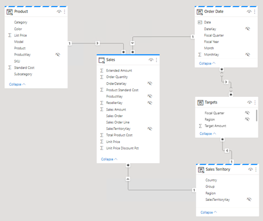
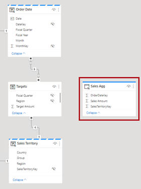
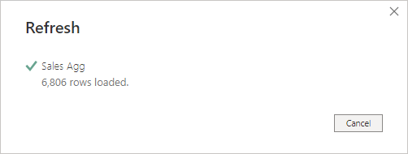

---
lab:
  title: 使用聚合提高查询性能
  module: Optimize enterprise-scale tabular models
---

# 使用聚合提高查询性能

## 概述

预估完成本实验室需要 30 分钟

在此实验室中，你将通过添加查询提高 Sales 事实数据表的查询性能。

在此实验室中，你将了解如何完成以下操作：

- 设置聚合。

- 使用性能分析器确定 Power BI 是否使用聚合。

## 入门

在本练习中，需要准备好环境。

### 克隆本课程的存储库

1. 在“开始”菜单上，打开“命令提示符”

    

1. 在命令提示符窗口中，键入以下内容导航到 D 驱动器：

    `d:` 

   按 Enter。

    

1. 在命令提示符窗口中，输入以下命令以下载课程文件并将其保存到名为 DP500 的文件夹中。
    
    `git clone https://github.com/MicrosoftLearning/DP-500-Azure-Data-Analyst DP500`
   
1. 克隆存储库后，关闭命令提示符窗口。 
   
1. 在文件资源管理器中打开 D 驱动器，确保文件已下载。

### 设置 Power BI Desktop

在此任务中，你将打开预先开发的 Power BI Desktop 解决方案。

1. 若要打开文件资源管理器，请选择任务栏上的文件资源管理器快捷方式。

2. 转到 D:\DP500\Allfiles\12\Starter 文件夹。

3. 若要打开预先开发的 Power BI Desktop 文件，请双击“Sales Analysis - Improve query performance with aggregations.pbix”文件。

    *如果收到潜在安全风险警告，请选择“确定”。
    
    *如果系统提示批准运行本机数据库查询，请选择“运行”。

4. 若要保存文件，请在“文件”功能区选项卡上选择“另存为” 。

5. 在“另存为”窗口中，转到 D:\DP500\Allfiles\12\MySolution 文件夹 。

6. 选择“保存”。

### 查看报表

在此任务中，你将查看预先开发的报表。

1. 在 Power BI Desktop 状态栏右下角，请注意存储模式为“混合”。

    

    混合模式模型包含来自不同源组的表。此模型包含一个从 Excel 工作簿获取数据的导入表。其余表使用 DirectQuery 连接到 SQL Server 数据库，即数据仓库。

2. 查看报表设计。

    

    此报表页有一个标题和两个视觉对象。可切片器视觉对象按某个会计年度进行筛选，而柱形图视觉对象可显示季度销售额和目标金额。在此实验室中，你会通过添加聚合来提高报表性能。

### 查看数据模型

在此任务中，你将查看预先开发的数据模型。

1. 切换到“模型”视图。

    

2. 使用模型图查看模型设计。

    

    该模型包括三个维度表和两个事实数据表。Sales 事实数据表表示销售订单详细信息，而 Targets 表表示季度销售目标。这是一种经典星型架构设计。其中一些表顶部的栏表示使用 DirectQuery 存储模式。具有蓝色栏的表示属于同一源组* *。

    三个维度表具有条纹条，表示它们使用双存储模式。这意味着表使用导入和 DirectQuery 存储模式。Power BI 确定最高效存储模式以按查询使用，尽可能使用导入模式，因为这样速度更快。

    在此实验室中，你将添加聚合以提高特定“Sales”表的查询性能**。

### 使用性能分析器

在此任务中，你将打开性能分析器，并用它来检查刷新事件。

1. 切换到“报表”视图。

    

2. 若要检查视觉对象刷新事件，请在“视图”功能区选项卡上的“显示”窗格组内选择“性能分析器”  。

    

3. 在“性能分析器”窗格（位于“可视化效果”窗格左侧）中，选择“开始录制”  。

    

    性能分析器检查并显示更新或刷新视觉对象所需的时间。每个视觉对象都至少向源数据库发出一个查询。有关详细信息，请参阅[使用性能分析器检查报表元素性能](https://docs.microsoft.com/power-bi/create-reports/desktop-performance-analyzer)。

4. 选择“刷新视觉对象”。

    

5. 在“性能分析器”窗格中，展开“按会计季度显示结果”视觉对象，并注意直接查询事件 。

6. 记下总持续时间（以毫秒为单位），以便稍后在此实验室中将其用作比较基线。

    

    每当看到直接查询事件时，就能知道 Power BI 使用 DirectQuery 存储模式从源数据库中检索数据。

    数据仓库事实数据表使用 DirectQuery 模式的一个常见原因是其数据量很大。导入如此大量数据是不现实的，在经济上也不可行。但是，数据模型可以缓存事实数据表的聚合视图，以帮助提高特定查询（通常是高级别查询）的性能。

    在此实验室中，你将添加“Sales”表数据的聚合，以专门提升按日期和销售区域查询“Sales Amount”列总和的视觉对象刷新性能* *。

## 设置聚合

在本练习中，你将设置聚合。

Power BI 中的聚合可以提高针对异常大型的 DirectQuery 表的查询性能。通过使用聚合，数据模型在内存中缓存聚合级别的数据。Power BI 会在聚合可用时自动使用聚合。

### 添加聚合表

在此任务中，你将向模型添加聚合表。

1. 若要打开“Power Query 编辑器”窗口，请在“主页”功能区选项卡上的“查询”组内，单击“转换数据”图标  。

    

2. 在 Power Query 编辑器窗口中的“查询”窗格中，右键单击“Sales”查询，然后选择“重复”  。

    

3. 在“查询”窗格中，注意新添加了查询。

    

    将应用转换以按“OrderDateKey”和“SalesTerritoryKey”列分组，并聚合“Sales Amount”列的总和*  *。

4. 在“查询设置”窗格（位于右侧）的“名称”框中，将文本替换为“Sales Agg”  。

    

5. 在“转换”功能区选项卡中的“表”组内选择“分组依据”  。

    

6. 在“分组依据”窗口中选择“高级”选项 。

    

    *使用高级选项，可按多个列分组。*

7. 在分组下拉列表中，选择“OrderDateKey”。

    

8. 选择“添加分组”。

    

9. 在第二个分组下拉列表中，选择“SalesTerritoryKey”。

    

10. 在“新列名”框中，将文本替换为“Sales Amount” 。

11. 在“操作”下拉列表中选择“求和” 。

12. 在“列”下拉列表中，选择“Sales Amount” 。

    

13. 选择“确定”。

    

14. 在“主页”功能区选项卡的“关闭”组内点击“关闭并应用”图标  。

    

    *Power BI Desktop 向模型添加新表。*

15. 保存 Power BI Desktop 文件。

    

### 设置模型属性

在此任务中，将设置新表的模型属性。

1. 切换到“模型”视图。

    

2. 在模型图中，将新表放置于“Targets”表右侧。

    

3. 请注意，“Sales Agg”表顶部有一个蓝色条，表示它使用的是 DirectQuery 存储模式。

    *尽管聚合可以使用 DirectQuery 存储模式，但在这种情况下，它们应连接到数据源中的具体化视图。在此实验室中，聚合将使用导入存储模式。*

4. 选择“Sales Agg”表。

5. 在“属性”窗格中，展开“高级”部分 。

    

6. 在“存储模式”下拉列表中，选择“导入” 。

    

7. 出现确认更新的提示时，请选择“确定”。

    

    警告会告知你，Power BI Desktop 将数据导入模型表可能需要相当长的时间。还会告知你此操作不可逆。除非从早期版本的 Power BI Desktop 文件进行还原，否则无法将导入存储模式表更改回 DirectQuery 存储模式表。

8. 请注意，Power BI Desktop 在新表中加载了 6,806 行数据。

    

    这些行表示每个订单日期和销售区域组合。这是一个非常少量的数据，汇总了可能数量巨大的事实数据表行。

9. 在“Sales Agg”表中选择“Sales Amount”列 。

10. 在“属性”窗格中的“格式设置”部分中，选择“数据类型”下拉列表中的“定点小数”   。

    

    若要管理聚合（在稍后的练习中），该数据类型必须与“Sales”表中的“Sales Amount”列的数据类型匹配* *。

11. 出现确认更新的提示时，请选择“确定”。

    

### 创建模型关系

在此任务中，你将创建两种模型关系。

1. 若要创建关系，请从“Order Date”表中拖动“DateKey”列并将其放置于“Sales Agg”表的“OrderDateKey”列上   。

    

2. 在“创建关系”窗口中，请注意“基数”下拉列表设置为“一对多”  。

    “Order Date”表中的“DateKey”列包含唯一值，而“Sales Agg”表中的“OrderDateKey”列包含重复值。这种一对多基数在基于事实数据表的维度和聚合之间的关系中很常见*   *。

3. 选择“确定”。

    

4. 在模型图中，请注意 Order Date 和 Sales Agg 表之间现在存在一种关系 。

5. 我们再创建一个关系，这次将“Sales Territory”表的“SalesTerritoryKey”列与“Sales Agg”表的“SalesTerritoryKey”相关联   。

    

6. 在“创建关系”窗口中选择“确定” 。

    

    在此实验室中完成的任务已将导入表添加到模型，并将其与其他模型表相关联。但是这还不是 Power BI 能透明地用于提升查询性能的聚合。你将在下一项任务中设置聚合。

7. 查看模型图，并注意“Sales Agg”表现与两个维度表相关。

    

### 设置聚合

在此任务中，你将设置聚合。

1. 在模型图中右键单击“Sales Agg”表格标题，然后选择“管理聚合” 。

    

2. 在“管理聚合”窗口中，为“OrderDateKey”列设置以下属性 ：

    - 摘要：GroupBy

    - 详细信息表：Sales

    - 详细信息列：OrderDateKey

    

3. 对于“Sales Amount”列，请设置以下属性：

    - 摘要：Sum

    - 详细信息表：Sales

    - 详细信息列：Sales Amount

4. 对于“SalesTerritoryKey”列，请设置以下属性：

    - 摘要：GroupBy

    - 详细信息表：Sales

    - 详细信息列：SalesTerritoryKey

5. 验证聚合设置是否如下所示：

    

6. 请注意描述 Power BI 将隐藏表的警告。

    

    Power BI Desktop 将以与其他隐藏模型对象不同的方式隐藏表。Power BI 将始终隐藏聚合，甚至模型计算也无法引用它们。

7. 选择“全部应用”。

    

8. 在模型图中，请注意“Sales Agg”是隐藏表。

    

    现在，每当视觉对象查询“Sales”表的“Sales Amount”列总和时，根据“Order Date”或“Sales Territory”表的任一列分组，Power BI 都将改用聚合*   *。

### 测试聚合

在此任务中，你将测试聚合并确定 Power BI 是否使用聚合。

1. 切换到“报表”视图。

    

2. 在“性能分析器”窗格中，选择“刷新视觉对象” 。

    

3. 展开“按会计季度显示销售结果”视觉对象，注意其中不再有直接查询事件。

4. 将持续事件与此实验室前面记录的基线进行比较。

    

    *当用户通过其他表筛选柱形图时，会发生什么情况？*

5. 若要克隆会计年度切片器，请先选择该切片器。

6. 在“主页”功能区选项卡上的“剪切板”组中，选择“复制”  。

    

7. 在“主页”功能区选项卡上的“剪切板”组中，选择“粘贴”  。

    

8. 将新切片器直接置于原始切片器下方。

    

9. 选择新的切片器，然后在“可视化效果”窗格的“字段”井中删除“Fiscal Year”字段  。

    

10. 在“字段”窗格中展开“Sales Territory”表，然后将“Group”字段拖放至“字段”井中   。

    

11. 在“组”切片器中任选一个组（空白组除外）。

    

    *Power BI 是否使用聚合？*

    答案是肯定的，因为聚合按“SalesTerritoryKey”列分组。该列与“Sales Territory”表关联。因为可以使用“Sales Territory”中的任意列来筛选柱形图视觉对象，并会使用聚合*  *。

12. 克隆组切片器以创建基于“Product”表的“Category”字段的切片器  。

    

    *Power BI 是否使用聚合？*

    答案是否定的，因为聚合未按“ProductKey”列（或“Product”表的任何列）分组。在这种情况下，Power BI 必须使用 DirectQuery 连接来刷新视觉对象* *。

    现在你已通过允许 Power BI 从模型缓存中检索数据提高了特定查询的性能。关键要点是聚合可以提高事实数据表查询的性能，尤其是针对特定度量值和高级别的分组。此外，双重存储模式和聚合协同运作，让 Power BI 能有机会避免使用与源数据之间昂贵的 DirectQuery 连接。

### 完成

在此任务中，你将完成操作。

1. 保存 Power BI Desktop 文件。

    

2. 关闭 Power BI Desktop。
