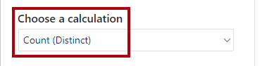

---
lab:
  title: 实时监视数据
  module: Implement advanced data visualization techniques by using Power BI
---

# 实时监视数据

## 概述

完成本实验室预计需要 30 分钟

在本实验室中，你将报表配置为使用自动页面刷新。 这样，报表使用者就可以实时监视 Internet 销售结果。

在此实验室中，你将了解如何完成以下操作：

- 使用性能分析器查看刷新活动。

- 设置自动页面刷新。

- 创建和使用更改检测功能。

## 入门

在本练习中，需要准备好环境。

### 克隆本课程的存储库

1. 在“开始”菜单上，打开“命令提示符”

    

1. 在命令提示符窗口中，键入以下内容导航到 D 驱动器：

    `d:` 

   按 Enter。

    

1. 在命令提示符窗口中，输入以下命令以下载课程文件并将其保存到名为 DP500 的文件夹中。
    
    `git clone https://github.com/MicrosoftLearning/DP-500-Azure-Data-Analyst DP500`
   
1. 克隆存储库后，关闭命令提示符窗口。 
   
1. 在文件资源管理器中打开 D 驱动器，确保文件已下载。

### 设置数据库

在此任务中，你将使用 SQL Server Management Studio (SSMS) 通过运行两个脚本来设置数据库。

1. 若要打开 SSMS，请在任务栏上选择 SSMS 快捷方式。

    

2. 在“连接到服务器”窗口中，确保“服务器名称”下拉列表设置为 localhost，并且“身份验证”下拉列表设置为 Windows 身份验证   。
    

3. 选择“连接”。
    
    

4. 若要打开脚本文件，请在“文件”菜单上选择“打开” > “文件”  。

5. 在“打开文件”窗口中，转到 D:\DP500\Allfiles\14\Assets 文件夹 。

6. 选择 1-Setup.sql 文件。

    

7. 选择“打开”。

    

8. 查看脚本。

    此脚本创建名为 FactInternetSalesRealTime 的表。不同的脚本会将数据加载到此表中，以模拟 Internet 销售订单的实时工作负载**。

9. 若要运行脚本，请在工具栏上选择“执行”（或按 F5） 。

    

10. 若要关闭文件，请在“文件”菜单上选择“关闭” 。

11. 打开 2-InsertOrders.sql 文件。

    

12. 另请查看此脚本。

    此脚本运行无限循环。它会为每个循环插入一个销售订单，然后随机延迟 1-15 秒的时间。

13. 运行此脚本，使其一直运行到实验室结束。

### 设置 Power BI Desktop

在此任务中，你将打开预先开发的 Power BI Desktop 解决方案。

1. 若要打开文件资源管理器，请选择任务栏上的文件资源管理器快捷方式。

    

2. 转到 D:\DP500\Allfiles\14\Starter 文件夹。

3. 若要打开预先开发的 Power BI Desktop 文件，请双击 Internet Sales - Monitor data in real time.pbix 文件。

4. 若要保存文件，请在“文件”功能区选项卡上，选择“另存为” 。

5. 在“另存为”窗口中，转到 D:\DP500\Allfiles\14\MySolution 文件夹 。

6. 选择“保存”。

### 查看报表

在此任务中，你将查看预先开发的报表。

1. 在 Power BI Desktop 中，查看报表页。

    

    此报表页有一个标题和两个视觉对象。卡片视觉对象显示销售订单数，而条形图视觉对象显示每个自行车子类别的销售额。

2. 若要刷新报表，请在“视图”功能区选项卡上的“显示”窗格组中，选择“性能分析器”  。

    

3. 在“性能分析器”窗格（位于“可视化效果”窗格右侧）中，选择“开始录制”  。

    

    性能分析器检查并显示更新或刷新视觉对象所需的时间。每个视觉对象都至少向源数据库发出一个查询。有关详细信息，请参阅[使用性能分析器检查报表元素性能](https://docs.microsoft.com/power-bi/create-reports/desktop-performance-analyzer)。

4. 选择“刷新视觉对象”。

    

5. 请注意，报表视觉对象会更新，以显示最新的 Internet 销售结果。

    开发连接到本地 DirectQuery 模型的报表时，无法使用“刷新”命令（位于“主页”功能区选项卡）刷新报表。这是因为 Power BI Desktop 会改为刷新 DirectQuery 表连接。若要刷新报表视觉对象，请按照刚刚执行的步骤操作。发布到 Power BI 服务时，报表使用者将能够选择操作栏上的“刷新”来刷新报表视觉对象*  *。

    设计用于实时分析的报表时，必须有一种比要求用户不断刷新报表页更好的方法。在下一个练习中设置自动页面刷新时，你将有更好的实现方法。

## 设置自动页面刷新

在本练习中，你将使用更改检测功能来设置自动页面刷新和试验。

自动页面刷新要求至少有一个设置为使用 DirectQuery 存储模式的模型表。

### 设置自动页面刷新

在此任务中，将设置自动页面刷新。

1. 若要选择报表页，请先选择报表页的空白区域。

2. 在“可视化效果”窗格中，选择格式图标（画笔）。

    

3. 将“页面刷新”设置（列表中的最后一个）切换为“打开” 。

    

    自动页面刷新是页面级设置。你可针对报表中的特定页面启用该设置。

4. 在“性能分析器”窗格中，注意报表视觉对象刚才进行了刷新。

5. 在“可视化效果”窗格中，展开“页面刷新”设置 。

    

6. 请注意，默认情况下，页面每 30 分钟刷新一次。

7. 将设置修改为每 5 秒刷新一次页面。

    

    重要提示：这种频繁的刷新间隔将帮助你高效地完成此实验室。但需要注意，因为设置如此频繁的刷新间隔可能会严重影响源数据库的性能和查看报表的其他用户。

    由于 Internet 销售订单每 1-15 秒加载一次，因此有时页面刷新会检索到相同的结果（因为数据库在过去五秒内没有记录任何订单）。最好是仅在需要时才刷新报表视觉对象。你将在下一个任务中设置更改检测功能来实现此操作。

    发布到 Power BI 服务后，如果刷新间隔少于 30 分钟，则需要将报表保存到分配给高级容量的工作区。此外，容量管理员必须启用并设置容量才能支持这种频繁的间隔。有关详细信息，请参阅 [Power BI 中的自动页面刷新](https://docs.microsoft.com/power-bi/create-reports/desktop-automatic-page-refresh)。

### 设置更改检测

在此任务中，将设置更改检测。

1. 在“页面刷新”设置中，将“刷新类型”下拉列表设置为“更改检测”  。

    

2. 若要创建更改检测度量值，请选择“添加更改检测”链接。

    

3. 请注意，“更改检测”窗口中的默认设置是创建新度量值。

    

4. 在“选择计算”下拉列表中，选择“计数(非重复)” 。

    

5. 在“字段”窗格（位于窗口内右侧）中，向下滚动以找到 Internet Sales 表 。

6. 选择“销售订单”字段，请注意，窗口已将其添加到“选择一个字段以将其应用到”框中 。

    

7. 对于“检查更改间隔”设置，请将其设置为 5 秒。

    

8. 选择“应用”。

    

9. 在“字段”窗格中的 Internet Sales 表中，请注意添加更改检测度量值 。

    

    Power BI 现在使用更改检测度量值，每五秒查询一次源数据库。每次，Power BI 都会存储结果，以便在下次使用时进行比较。当结果不同时，意味着数据已更改（在本例中，数据库插入了新的 Internet 销售订单）。在这种情况下，Power BI 会刷新所有报表页视觉对象。

    发布到 Power BI 服务后，Power BI 仅支持高级容量的更改检测度量值。

10. 在“性能分析器”窗格中，选择“清除” 。

    

11. 请注意，性能分析器会显示更改检测查询。

12. 请注意，有时在 Power BI Desktop 刷新报表视觉对象之前，会发生多个更改检测查询。

    这是因为数据库当时没有插入新的 Internet 销售订单。此设置现在更高效，因为报表视觉对象仅在必要时刷新。

### 完成

在此任务中，你将完成以下操作。

1. 保存 Power BI Desktop 文件。

    

2. 关闭 Power BI Desktop。

3. 在 SSMS 中，若要停止运行脚本，请在工具栏上选择“停止”（或按 Alt+Break） 。

    

4. 关闭脚本文件。

5. 打开 3-Cleanup.sql 文件。

    

    此脚本移除了 FactInternetSalesRealTime 表**。

6. 运行该脚本。

7. 关闭 SSMS。
