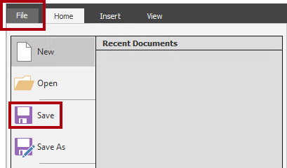
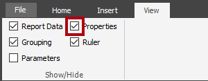
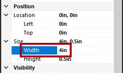
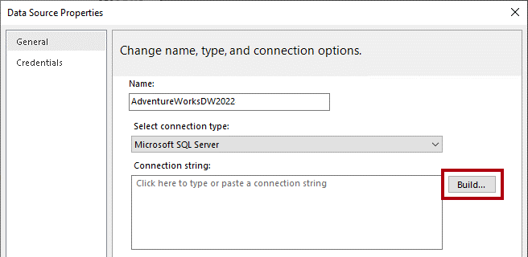
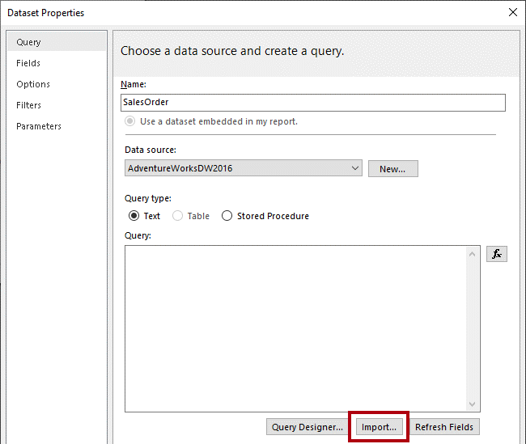
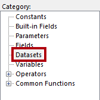
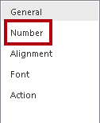
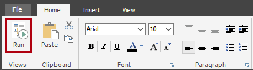
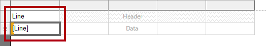
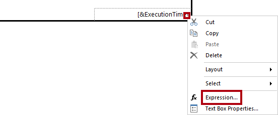

# 创建分页报表

## 概述

**预估完成本实验室需要 45 分钟**

在此实验室中，使用 Power BI Report Builder 开发一个从 AdventureWorksDW2022-DP500 SQL Server 数据库中获取数据的像素完美分页报表布局。 然后创建数据源和数据集，并配置报表参数。 报表布局可使数据呈现在多个页面上，并以 PDF 格式和其他格式导出。

最终报表如下所示：


在此实验室中，你将了解如何完成以下操作：

- 使用 Power BI Report Builder

- 设计多页面报表布局

- 定义数据源

- 定义数据集

- 创建报表参数

- 将报表导出为 PDF

## 入门

在此练习中，打开 Power BI Report Builder 创建一个报表并保存它。

### 克隆本课程的存储库

1. 在“开始”菜单上，打开“命令提示符”

    

1. 在命令提示符窗口中，键入以下内容导航到 D 驱动器：

    `d:` 

   按 Enter。

    


1. 在命令提示符窗口中，输入以下命令以下载课程文件并将其保存到名为 DP500 的文件夹中。
    
    `git clone https://github.com/MicrosoftLearning/DP-500-Azure-Data-Analyst DP500`
   
1. 克隆存储库后，关闭命令提示符窗口。 
   
1. 在文件资源管理器中打开 D 驱动器，确保文件已下载。

### 创建报表

在此任务中，打开 Power BI Report Builder 创建一个报表并保存它。

1. 若要打开 Power BI Report Builder，请在任务栏上选择“Power BI Report Builder”快捷方式。

    

1. 如果系统提示更新到最新版 Power BI Report Builder，请选择“取消”。

2. 在“Power BI Report Builder”窗口中，若要创建新报表，可在“入门”窗口中选择“空白报表” 。

    

  
3. 若要保存报表，选择“文件”选项卡（位于左上角），然后选择“保存” 。

    

4. 在“另存为报表”窗口中，导航到 D:\DP500\Allfiles\15\MySolution 文件夹 。

5. 在“名称”框中，输入“销售订单报表”。

6. 选择“保存”。

## 开发报表布局

在此练习中，你将开发报表布局，然后探索最终的报表设计。

### 配置报表页眉

在此任务中，配置报表页眉。

1. 在报表设计器中，请注意默认报表布局，它由正文区域和报表页脚区域组成。

    

    *正文中包含一个为报表标题准备的单个文本框，报表页脚包含一个用于说明报表执行时间的单个文本框。*

    默认设计将在第一个呈现页面上的正文中呈现一次报表标题。但是，现在你可通过添加报表页眉区域并将报表标题文本框移动到该区域来修改报表设计。这样，报表标题将在每个页面上重复出现。你还将添加公司徽标的图像。

2. 若要添加报表页眉区域，在“插入”功能区选项卡上，从“页眉和页脚”组中，打开“页眉”，然后选择“添加页眉”   。

    

3. 在报表设计器中，可注意到已将一个报表页眉区域添加到报表布局中。

4. 若要选择正文文本框，请选中“单击以添加标题”文本框。

5. 若要移动文本框，选择四向箭头图标，将其拖到页眉区域中，然后将其放至报表页眉区域的最左上角。

    

6. 若要修改报表标题文本框文本，请选择文本框内的区域，然后输入：销售订单报表

    若要调整文本框的大小，首先要打开“属性”窗格。若要对位置和大小属性进行精细控制，需要使用“属性”窗格 。

7. 在“视图”功能区选项卡上的“显示/隐藏”组中，选择“属性”  。

    

8. 若要将焦点放在报表标题文本框上，请先选择文本框外的区域，然后再次选择文本框。

    *文本框边框突出显示，且边框上出现重设大小图柄（小圆圈）时，该文本框已被选中。*

9. 在“属性”窗格（位于右侧）中，向下滚动列表以找到“位置”组。

    

    通过“位置”组，可设置报表项的位置和大小的精确值**。

    重要提示：请按本实验室中的指示输入值。需要像素完美的布局才能在实验室结束时实现页面呈现。

10. 在“位置”组内，展开“位置”组，并确保“Left”和“Top”属性均设置为“0 英寸”。

    位置和大小单位为英寸，因为实验室虚拟机的区域设置为美国。如果你的区域使用公制度量单位，则默认单位为厘米。

11. 在“位置”组内，展开“大小”组，然后将“Width”属性设置为“4”。

    


12. 若要插入图像，在“插入”功能区选项卡上的“报表项”组中，选择“图像”  。

    

13. 若要将图像添加到报表设计中，请选择报表标题文本框右侧的报表页眉区域内的区域。

14. 在“图像属性”窗口中，若要从图像文件导入，请选择“导入” 。

    

15. 在“打开”窗口中，导航到 D:\DP500\Allfiles\15\Assets 文件夹，然后选择 AdventureWorksLogo.jpg 文件  。

16. 选择“打开”。

17. 在“图像属性”窗口中，选择“确定” 。

18. 在报表设计器中，可注意到已添加并选中了该图像。

 

19. 若要定位图像并调整其大小，请在“属性”窗格中配置以下属性：

    |  **属性** | **值** |
    |--- | --- |
    |  位置 > 位置 > 靠左| 5 |
    |  位置 > 位置 > 靠上| 0 |
    |  位置 > 大小 > 宽度| 1 |
    |  位置 > 大小 > 高度| 1 |


20. 若要调整报表页眉区域的大小，先选择区域中的空白部分以将焦点放在该区域上。

21. 在“属性”窗格中，将“常规” > “高度”属性设置为“1”   。

22. 验证报表页眉区域是否包含单个文本框和图像，如下所示：

    

23. 若要保存报表，在“文件”选项卡上，选择“保存” 。

    提示：还可以选择左上角的磁盘图标。

    

    *现在，可配置报表以检索数据库查询结果。*


### 检索数据

在此任务中，创建一个数据源和数据集，以从 AdventureWorksDW2022-DP500 SQL Server 数据库检索查询结果。

1. 在“报表数据”窗格（位于左侧）中，右键单击“数据源”文件夹，然后选择“添加数据源”。

    

    可以从云/本地数据库或 Power BI 数据集检索数据。

2. 在“数据源属性”窗口的“名称”框中，将文本替换为 AdventureWorksDW2022  。

3. 在“选择连接类型”下拉列表中，可注意到 Microsoft SQL Server 已被选中。

4. 若要生成连接字符串，选择“生成”。

    


5. 在“连接属性”窗口中的“服务器名称”框中，输入 localhost。

    在此实验室中，将使用 localhost 连接到 SQL Server 数据库。但是，创建自己的解决方案时不建议这样做，因为网关数据源无法解析 localhost* *。

6. 在“选择或输入数据库名称”下拉列表中，选择 AdventureWorksDW2022-DP500 数据库 。

7. 选择“确定”。

8. 在“数据源属性”窗口中，选择“确定” 。

9. 在“报表数据”窗格中，可注意到已添加 AdventureWorksDW2022 数据源 。

    

10. 若要创建数据集，在“报表数据”窗格中，右键单击 AdventureWorksDW2022 数据源，然后选择“添加数据集”  。

    

    *报表数据集在用途和结构上与 Power BI 数据集不同。*

11. 在“数据集属性”窗口的“名称”框中，将文本替换为 SalesOrder。


12. 若要导入预定义的查询，选择“导入”。

    

13. 在“导入查询”窗口中，导航到 D:\DP500\Allfiles\15\Assets 文件夹，然后选择 SalesOrder.sql 文件  。

14. 选择“打开”。

15. 在“查询”框中查看查询，并确保向下滚动到查询文本的底部。

    了解查询语句的详细信息并不重要。它旨在检索销售订单行详细信息。WHERE 子句包含一个谓词，用于将查询结果限制为单个销售订单。ORDER BY 子句可确保行按行号顺序返回行。

16. 注意 WHERE 子句中使用了 @SalesOrderNumber，它表示一个查询参数。

    

    查询参数是将在查询执行时传递的值的占位符。你将配置报表参数以提示报表用户输入单个销售订单号，该订单号随后会传递给查询参数。

17. 选择“确定”。


18. 在“报表数据”窗格中，可注意到已添加“SalesOrder”数据集及其字段。

    

    字段用于在报表布局中配置数据区域。它们派生自数据集查询列。

19. 保存报表。

### 配置报表参数

在此任务中，使用默认值配置报表参数。

1. 在“报表数据”窗格中，展开“参数”文件夹以显示“SalesOrderNumber”报表参数。

    

    创建数据集时，会自动添加 SalesOrderNumber 报表参数。这是因为数据集查询包含 @SalesOrderNumber 查询参数* *。

2. 若要编辑报表参数，右键单击“SalesOrderNumber”报表参数，然后选择“参数属性”。

    

3. 在“报表参数属性”窗口中的左侧，选择“默认值”页。

    

4. 选择“指定值”选项。

    

5. 若要添加默认值，请选择“添加”。


6. 在“值”下拉列表中，将文本替换为 43659。

    

    *销售订单 43659 是最初用于测试报表设计的值。*

7. 选择“确定”。

8. 保存报表。

    *现在，添加用于描述销售订单的文本框，完成报表页眉区域设计。*

### 完成报表页眉布局

在此任务中，通过添加文本框来完成报表页眉区域设计。

1. 若要将文本框添加到报表页眉区域，请在“插入”功能区选项卡上的”报表项”组中，选择“文本框”  。

    

2. 直接在报表标题文本框下方，选择报表页眉区域中的区域。

3. 在新文本框中，输入“销售订单:”，后跟一个空格。

4. 若要紧接着在刚刚输入的空格之后插入占位符，右键单击鼠标，然后选择“创建占位符”。

    


5. 在“占位符属性”窗口中，在“值”下拉列表的右侧，选择“fx”按钮  。

    

    通过 fx 按钮可输入自定义表达式。此表达式将用于返回销售订单号**。

6. 在“表达式”窗口的“类别”列表中，选择“参数”。

    

7. 在“值”列表中，双击“SalesOrderNumber”参数。

8. 在表达式框中，可注意到已添加对“SalesOrderNumber”报表参数的编程引用。

    

9. 选择“确定”。

10. 在“占位符属性”窗口中，选择“确定” 。

11. 选择报表页眉区域的空白区域，然后选中新的文本框。

12. 在“属性”窗格中，配置以下位置属性：

    |  **属性**| **值** |
    | --- | --- |
    |  位置 > 位置 > 靠左| 0 |
    |  位置 > 位置 > 靠上| 0.5 |
    |  位置 > 大小 > 宽度| 4 |
    |  位置 > 大小 > 高度| 0.25 |


13. 若要设置部分文本框文本的格式，在新文本框内仅选择“销售订单:”文本。

    

14. 在“主页”功能区选项卡的“字体”组中，选择“加粗”命令  。

    

15. 将另一个文本框添加到报表页眉区域，然后输入文本“ 经销商:”，后跟一个空格。

    提示：还可以通过右键单击画布，然后选择“插入” > “文本框”来添加文本框* *。

16. 在空格后插入一个占位符，然后设置占位符的值以使用一个表达式。


17. 在“表达式”窗口的“类别”列表中，选择“数据集”。

    

18. 使表达式值以 First(Reseller) 值为基础。

19. 在“属性”窗格中，配置以下位置属性：

    |  **属性**| **值** |
    | --- | --- |
    |  位置 > 位置 > 靠左| 0 |
    |  位置 > 位置 > 靠上| 0.75 |
    |  位置 > 大小 > 宽度| 4 |
    |  位置 > 大小 > 高度| 0.25 |


20. 将“经销商:”文本格式设置为粗体。

21. 将第三个（最后一个）文本框添加到报表页眉区域，然后输入文本“订单日期:”，后跟一个空格。

22. 在空格后插入一个占位符，然后设置占位符的值以使用基于“数据集”类别 First(OrderDate) 值的表达式。

    


23. 若要设置日期值的格式，在“占位符属性”窗口中，选择“数字”页。

    

24. 在“类别”列表中选择“日期”。

    

25. 在“类型”列表中选择一种合适的日期格式类型。

26. 在“占位符属性”窗口中，选择“确定” 。

27. 在“属性”窗格中，配置以下位置属性：

    |  **属性**| **值** |
    | --- | --- |
    |  位置 > 位置 > 靠左| 0 |
    |  位置 > 位置 > 靠上| 1 |
    |  位置 > 大小 > 宽度| 4 |
    |  位置 > 大小 > 高度| 0.25 |


28. 将“订单日期:”文本格式设置为粗体。

29. 最后，选择报表页眉区域的空白区域。

30. 在“属性”窗格中，将“Height”属性设置为 “1.5”。


31. 验证报表标头区域是否如下所示：

    

32. 保存报表。

33. 若要预览报表，在“主页”功能区选项卡上的“视图”组中，选择“运行”  。

    

    运行报表后，将以 HTML 格式呈现报表。由于唯一的报表参数具有默认值，因此报表将自动运行。

34. 验证呈现的报表是否如下所示：

    


35. 若要返回到设计视图，在“运行”功能区选项卡上的“视图”组中，选择“设计”  。

    

    *现在，你要向报表正文中添加一个表格以显示销售订单行的格式化布局。*

### 添加表数据区域

在此任务中，向报表正文中添加表数据区域。

1. 在“插入”功能区选项卡上的“数据区域”组中，打开“表格”，然后选择“插入表格”   。

    

2. 若要添加表格，选择报表正文中的空白区域。

3. 在“属性”窗格中，配置以下位置属性：

    |  **属性**| **值** |
    | --- | --- |
    |  位置 > 位置 > 靠左| 0 |
    |  位置 > 位置 > 靠上| 0 |


    该表将显示五列。默认情况下，表格模板仅包含三列。


4. 若要向表格中添加列，请右键单击最后一列的任意单元格，然后选择“插入列” > “右侧” 。

    

5. 重复最后一步，再添加一个新列。

6. 将光标悬停在第一列第二行的单元格上，可显示字段选取器图标。

    

7. 选择字段选取器图标，然后选择“行”字段。

    

8. 可注意到现在该表格的第一行（标题）中包含一个文本值，且详细信息行中包含一个字段引用。

    

9. 按顺序向以下四列添加字段，如下所示：

    - 产品

    - 数量

    - 单价

    - 金额

10. 验证表格设计是否如下所示：

    

11. 保存报表。

12. 预览报表。

    

    

    该表格包含 1 行标题和 12 行销售订单行。通过设置表格布局的格式可进行很多改进。

    *在下一任务中，你将执行以下操作：*

    - *使用背景色和粗体字体样式设置表格标题的格式*

    - *修改列宽，删除冗余空间并防止长文本值换行*

    - *向左对齐第一列值*

    - *向右对齐最后三列值*

    - *使用货币符号（美元）设置货币值的格式*

    - *为表格添加一个总计行并设置其格式*


### 设置表数据区域的格式

在此任务中，设置表数据区域的格式。

1. 返回到设计视图。

2. 选择表中的任何单元格，以显示灰色单元格参考线（位于数据区域的顶部和左侧）。

    

    *单元格参考线有助于配置整行或整列。*

3. 若要设置表格标题的格式，选择标题行参考线。

    

    选择行或列参考线会选中该行或列中的所有单元格。实际上，每个单元格都是一个文本框。然后，可使用“属性”窗格或功能区命令来设置单个文本框或所选的多个文本框的格式**。

4. 在“属性”窗格（或功能区）中，配置以下位置属性：

    |  **属性**| **值** |
    | --- | --- |
    |  填充 > 背景色| DarkGreen（提示：将光标悬停在每个颜色上可显示其名称） |
    |  字体 > 颜色| White |
    |  字体 > 字体 > 字体粗细| Bold |


5. 选择第一列参考线。

    

6. 在“属性”窗格中，将“位置” > “大小” > “宽度”属性设置为“0.5”    。

7. 将第二列的宽度设置为“2.5”。

8. 选择“数量”列参考线，然后在按住 Ctrl 键的同时选择最后两个列标题参考线（“单价”和“金额”）   。

9. 在“属性”窗格（或功能区）中，将“对齐” > “TextAlign”属性设置为“右”   。

10. 将“行”详细信息文本框设置为左对齐。

    

11. 在“主页”功能区选项卡上的“数字”组中，设置最后两个详细信息（非标题）文本框（“单价”和“金额”）以使用货币符号进行格式设置。

    

    


12. 若要向表格中添加总计行，右键单击“数量”详细信息文本框，然后选择“添加总计”。

    

13. 可注意到已添加一个表示表格页脚的新行，并且表达式将计算“数量”值之和。

14. 重复最后一步，为“金额”详细信息文本框添加总计行。

15. 在表格页脚行的第一个单元格中，输入词“总计”。

16. 将页脚行中的所有文本框的格式设置为粗体。

17. 验证表格设计是否如下所示：

    


18. 若要删除表格后的任何尾随空格，将光标悬停在报表正文和报表页脚区域之间的虚线上，然后向上拖动直达表格的底部。

    

19. 保存报表

20. 预览报表。

21. 验证呈现的报表是否如下所示：

    

22. 在“销售订单号”参数框中，将值替换为 51721。

    

23. 若要重新运行报表，请在右侧选择“查看报表”。

    

    *此销售订单具有 72 个销售订单行，因此数据将呈现在多个页面中。*

24. 若要导航到报表的第二页，请在“运行”功能区选项卡的“导航”组中，选择“下一页”  。

    

25. 在第 2 页上，可注意到表格标题不会显示。

    *你要在下一任务中解决此问题。*

26. 滚动到页面底部，然后可注意到报表页脚只显示执行时间。

    *在下一任务中，你要通过追加页码来改进页脚文本。*

### 完成报表设计

在此任务中，通过确保多页报表正确呈现来完成报表设计。

1. 切换到设计视图。

2. 若要确保表格标题在所有页上重复显示，先选中表格的任意文本框。

3. 在“分组”窗格（位于报表设计器的底部）中，在“列组”的最右侧，选择向下箭头，然后选择“高级模式”  。

    

4. 在“行组”部分中，选择第一个静态组。

    

    *此操作选中了表格标题行。*

5. 在“属性”窗格中，将“其他” > “RepeatOnNewPage”属性设置为“True”   。

    *这可确保第一个静态组（表示表格标题）在所有页上重复显示。*

6. 在表格页脚区域中，右键单击“ExecutionTime”文本框，然后选择“表达式”。

    

7. 在“表达式”窗口中的表达式框中，追加一个空格，后跟“&amp; " | 页面 " &amp;”，以生成以下表达式 ：


    ```
    =Globals!ExecutionTime & " | Page " &
    ```


8. 确保最后一个“&”号后跟一个空格。

9. 在“类别”列表中选择“内置字段”。

    

10. 若要将页码值插入表达式，在“项”列表中，双击“PageNumber”。

11. 验证完整表达式是否如下所示：

    

12. 选择“确定”。

13. 拖动文本框的左侧，将宽度增加到报表页面的宽度。

    

    报表设计现已完成。最后，请确保页面宽度恰好设置为 6 英寸，并移除报表参数默认值。

14. 若要选择报表正文，请右键单击任何表文本框，然后选择“选择” > “正文” 。

    

    *当表格填充整个报表正文时，必须使用此方法来选择报表正文。*

15. 在“属性”窗格中，确保将“位置” > “大小” > “宽度”属性设置为“6”    。

    宽度不能大于 6 英寸，这一点很重要，因为以打印格式呈现会将表格分成多页。

16. 在“报表数据”窗格中，打开“SalesOrderNumber”报表参数属性。

17. 在“默认值”页上，选择“无默认值”选项。

    

18. 选择“确定”。

19. 保存报表。

  

### 浏览已完成的报表

在此任务中，以打印布局模式查看报表。

1. 预览报表。

2. 在“销售订单号”参数框中，输入值 51721。

3. 在“运行”功能区选项卡上的“打印”组中，选择“打印布局”  。

    

    *打印布局模式提供了将报表按严格的页面尺寸打印时的外观预览。*

4. 导航到第 2 页和第 3 页。

    在此实验室中，不会发布报表。请注意，只有当分页报表存储在其许可模式设置为“Premium per user”或“Premium per capacity”的工作区中，并且该容量已启用分页报表工作负载时，才能在 Power BI 服务中呈现分页报表* *。
