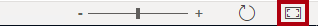
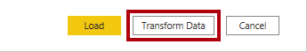
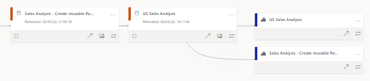

---
lab:
  title: 创建可重用的 Power BI 资产
  module: Manage the analytics development lifecycle
---

# <a name="create-reusable-power-bi-assets"></a>创建可重用的 Power BI 资产

## <a name="overview"></a>概述

**预估完成本实验室需要 45 分钟**

在本实验室中，你将创建可扩展核心数据集的专用 Power BI 数据集。 专用数据集将能够分析美国人均销售额。

在此实验室中，你将了解如何完成以下操作：

- 创建实时连接。

- 创建本地 DirectQuery 模型。

- 使用世系视图发现依赖项 Power BI 资产。

## <a name="get-started"></a>入门

在本练习中，需要准备好环境。

### <a name="clone-the-repository-for-this-course"></a>克隆本课程的存储库

1. 在“开始”菜单上，打开“命令提示符”

    

1. 在命令提示符窗口中，键入以下内容导航到 D 驱动器：

    `d:` 

   按 Enter。

    


1. 在命令提示符窗口中，输入以下命令以下载课程文件并将其保存到名为 DP500 的文件夹中。
    
    `git clone https://github.com/MicrosoftLearning/DP-500-Azure-Data-Analyst DP500`
   
1. 克隆存储库后，关闭命令提示符窗口。 
   
1. 在文件资源管理器中打开 D 驱动器，确保文件已下载。

### <a name="set-up-power-bi"></a>设置 Power BI

在此任务中，你将设置 Power BI。

1. 若要打开 Power BI Desktop，请在任务栏上选择 Power BI Desktop 快捷方式。

    

2. 选择位于开始窗口右上角的“X”。

    

3. 如果尚未登录，请在 Power BI Desktop 右上角选择“登录”。 使用实验室凭据完成登录过程。

    
4. 你将重定向到 Microsoft Edge 中的 Power BI 注册页面。 选择“继续”以完成注册。

    

5. 输入 10 位电话号码，然后选择“开始”。 再次选择“开始”。 你将重定向到 Power BI。

1. 在右上角选择“个人资料”图标，然后选择“开始试用”。

    

1. 出现提示时，选择“开始试用”。

    

1. 执行所有剩余任务以完成试用设置。

    提示：Power BI Web 浏览器体验称为 Power BI 服务**。

### <a name="create-a-workspace-in-the-power-bi-service"></a>在 Power BI 服务中创建工作区

在此任务中，你将创建一个工作区。

1. 若要在 Power BI 服务中创建工作区，请在“导航”窗格中（位于左侧）选择“工作区”，然后选择“创建工作区”  。

    


2. 在“创建工作区”窗格（位于右侧）的“工作区名称”框中，输入工作区的名称 。

    工作区名称在租户内必须是唯一的。

    

3. 选择“保存”。

    

    创建后会打开该工作区。在下一项任务中，你要将数据集发布到此工作区。

### <a name="open-the-starter-file-in-power-bi-desktop"></a>在 Power BI Desktop 中打开起始文件

1. 若要打开文件资源管理器，请选择任务栏上的文件资源管理器快捷方式。

    

2. 转到 D:\DP500\Allfiles\16\Starter 文件夹。

3. 若要打开预先开发的 Power BI Desktop 文件，请双击“Sales Analysis - Create reusable Power BI artifacts.pbix”文件。

4. 如果尚未登录，请在 Power BI Desktop 右上角选择“登录”。 使用实验室凭据完成登录过程。

    

### <a name="review-the-data-model"></a>查看数据模型

在此任务中，你将查看数据模型。

1. 在 Power BI Desktop 左侧，切换到“模型”视图。

    

2. 使用模型关系图查看模型设计。

    

    该模型包括六个维度表和一个事实数据表。Sales 事实数据表存储销售订单详细信息。这是一种典型的星型架构设计**。

### <a name="publish-the-data-model"></a>发布数据模型

在此任务中，你将发布数据模型。

1. 若要发布报表，请在“主页”功能区选项卡上选择“发布”。  

    当系统提示选择是否保存更改时，请选择“保存”**。

    

2. 在“发布到 Power BI”窗口中选择工作区（请勿选择个人工作区），然后选择“选择” 。

    

3. 发布成功后，选择“知道了”。

    

    *发布后，模型将成为 Power BI 数据集。在此实验室中，此数据集是可供业务分析师进行扩展以创建专用数据集的核心数据集。在下一个练习中，你将创建专用数据集来解决特定的业务要求。*

4. 关闭 Power BI Desktop。

5. 当系统提示你保存更改时，请选择“不保存”。

    

## <a name="create-a-specialized-dataset"></a>创建专用数据集

在本练习中，你将创建一个专用数据集，以便分析美国人均销售额。 因为核心数据集不包含总体值，所以需添加新表以扩展模型。

### <a name="create-a-live-connection"></a>创建实时连接

在此任务中，你将创建一个新报表，该报表使用与“销售分析 - 创建可重用的 Power BI 项目”数据集（在上一练习中发布的数据集）的实时连接。

1. 若要打开 Power BI Desktop，请在任务栏上选择“Power BI Desktop”快捷方式。

    

2. 选择位于入门窗口右上角的“X”。

    

3. 若要保存文件，请在“文件”功能区上选择“另存为” 。

4. 在“另存为”窗口中，转到 D:\DP500\Allfiles\16\MySolution 文件夹 。

5. 在“文件名”框中，输入“US Sales Analysis” 。

    

6. 选择“保存”。

7. 若要创建实时连接，请在“主页”功能区选项卡上的“数据”组中选择“Power BI 数据集”  。

    

8. 在“选择一个数据集来创建报表”窗口中选择“Sales Analysis - Create reusable Power BI artifacts”数据集 。

    

9. 选择“创建”。

    

10. 在左下角的状态栏中，请注意报表将实时连接到数据集。

    

11. 切换到“模型”视图。

    

12. 如有必要，可通过选择右下角的“适应屏幕”来调整模型图的大小以适应屏幕。

    

13. 将光标悬停在任何表格标题上，可显示工具提示，请注意数据源类型为 SQL Server Analysis Services，服务器引用工作区，数据库是数据集。

    

    这些属性指示远程模型托管表。在下一项任务中，你将对模型进行更改以对其进行扩展。该过程将创建本地 DirectQuery 模型，可以通过多种方式进行修改。

14. 保存 Power BI Desktop 文件。

    

### <a name="create-a-local-directquery-model"></a>创建本地 DirectQuery 模型

在此任务中，你将创建本地 DirectQuery 模型。

1. 在“开始”功能区选项卡上，在“建模”组内选择“对此模型进行更改”  。

    

    *注意：如果未看到更改此模型的选项，则需要启用预览功能：适用于 PBI 数据集和 AS 的 DirectQuery*
    - 请导航至“文件” > “选项和设置” > “选项”，然后在“预览功能”部分，选中“适用于 Power BI 数据集和 Analysis Services 的 DirectQuery”复选框来启用此预览功能  。 可能需要重新启动 Power BI Desktop 以使更改生效。 

2. 出现提示时，请阅读对话框窗口消息，然后选择“添加本地模型”。

    

    *该模型现在是 DirectQuery 模型。现在可以通过修改某些表或列属性或者添加计算列来增强模型。甚至可以使用从其他数据源获取数据的新表扩展模型。你将通过添加表来向模型添加美国人口数据。*

3. 将光标悬停在任何表格标题上，可显示工具提示，请注意表存储模式设置为 DirectQuery。

    

### <a name="design-the-report-layout"></a>设计报表布局

在此任务中，你将设计报表布局以分析美国州销售额。

1. 切换到“报表”视图。

    

2. 在“字段”窗格（位于右侧）中展开“Reseller”表 。

3. 右键单击“Country-Region”字段，并选择“添加到筛选器” > “报表级筛选器”  。

    

4. 展开“筛选器”窗格（位于“可视化效果”窗格左侧） 。

5. 在“筛选器”窗格的“所有页面上的筛选器”部分中，选择“Country-Region”卡中的“United States”   。

    

6. 若要添加表视觉对象，请在“可视化效果”窗格中选择表视觉对象图标。

    

7. 重新调整该表的位置和大小，使其占据整个页面。

8. 在“字段”窗格中的“Reseller”表中，拖动“State-Province”字段并将其放置到表视觉对象中  。

    

9. 在“字段”窗格中展开“Sales”表，然后将“销售额”字段添加到表视觉对象中  。

    

10. 若要按销售额降序对各州进行排序，请选择“销售额”标题。

    

    *此报表布局现在提供有关美国州销售额的基本详细信息。但额外的要求是显示人均销售额，并按该度量值的降序对各州进行排序。*

### <a name="add-a-table"></a>添加表

在此任务中，你将添加从网页获取数据的美国人口数据表。

1. 切换到“模型”视图。

    

2. 在“开始”功能区选项卡上的“数据”组中选择“获取数据”，然后选择“Web”   。

    

3. 在 URL 框中输入以下文件路径：D:\DP500\Allfiles\16\Assets\us-resident-population-estimates-2020.html 

    为了达到此实验室的目的，Power BI Desktop 将从文件系统访问网页。

    提示：可从 D:\DP500\Allfiles\16\Assets\Snippets.txt 文件复制和粘贴此文件路径**。

4. 选择“确定”。

    

5. 在“导航器”窗口中的右侧位置切换到“Web 视图” 。

    

    *该网页显示从 2020 年 4 月人口普查获取的美国常住人口估计值。*

6. 切换回表视图。

    

7. 在左侧选择“任务 2”。

    

8. 请注意表视图预览。

    *此数据表包含模型计算人均销售额所需的数据。你需要通过应用转换来准备数据：具体而言，就是要删除“United States”行和“RANK”列，并重命名“STATE”和“NUMBER”列   *。

9. 要准备数据，请选择“转换数据”。

    

10. 在 Power Query 编辑器窗口的“查询设置”窗格（位于右侧）的“名称”框中，将文本替换为“US Population”，然后按 Enter 键   。

    

11. 要删除“United States”行，请在“STATE”列标题中选择向下箭头，然后取消选择“United States”项（滚动到列表底部）  。

    

12. 选择“确定”。

    

13. 若要删除“RANK”列，请右键单击列标题，然后选择“删除” 。

    

14. 若要重命名“STATE”列，请双击列标题，将文本替换为“State”并按 Enter 键  。

15. 将“NUMBER”列重命名为“Population” 。

    

16. 若要应用查询，请在“主页”功能区选项卡上的“关闭”组内，选择“关闭并应用”图标  。

    

17. 如果系统提示存在潜在安全风险，请阅读通知，然后选择“确定”。

    

    *Power BI Desktop 应用查询来创建模型表。它添加了一个新表，用于将人口数据导入模型。*

18. 将“US Population”表的位置调整至“Reseller”表附近 。

19. 要创建模型关系，请在“US Population”表中拖动“State”列，并将其放置于“Reseller”表的“State-Province”列上   。

    

20. 在“创建关系”窗口的“交叉筛选方向”下拉列表中，选择“双向”。

    

    “Reseller”表的每一行都存储一个经销商，因此“State-Province”中的值将包含重复值（例如加利福尼亚州有很多经销商）。在创建关系时，Power BI Desktop 会自动确定列基数并识别出其中存在的多对一关系。为了确保筛选器能从“Reseller”表传播到“US Population”表，该关系必须是双向进行交叉筛选的*   *。

21. 选择“确定”。

    

22. 若要隐藏新表，请在“US Population”表中选择可见性图标。

    

    表不需要对报表作者可见。

### <a name="add-a-measure"></a>添加度量值

在此任务中，你将添加一个度量值来计算人均销售额。

1. 切换到“报表”视图。

    

2. 在“字段”窗格中，右键单击“Sales”表，然后选择“新建度量值”  。

    

3. 在编辑栏中输入以下度量值定义。

    提示：可从 D:\DP500\Allfiles\16\Assets\Snippets.txt 文件复制和粘贴度量值定义**。

    ```
    Sales per Capita =
    DIVIDE(
    SUM(Sales[Sales Amount]),
    SUM('US Population'[Population])
    )
    ```

    名为“Sales per Capita”的度量值使用 DAX [DIVIDE](https://docs.microsoft.com/dax/divide-function-dax) 函数将“Sales Amount”列的总和除以“Population”列的总和*  *。

4. 在“度量工具”上下文功能区选项卡上的“格式设置”组内的小数位框中，输入“4”  。

    

5. 若要将度量值添加到矩阵视觉对象，请在“字段”窗格中，从“Sales”表中将“Sales per Capita”字段拖动到表视觉对象中  。

    *该度量值通过将 Power BI 服务中来自远程模型的数据源与来自新模型本地导入表的数据相结合来评估结果。*

6. 若要按人均销售额的降序对各州进行排序，请选择“Sales per Capita”列标题。

    

### <a name="publish-the-solution"></a>发布解决方案

在此任务中，你将发布包括专用数据模型和报表的解决方案。

1. 保存 Power BI Desktop 文件。

    

2. 若要发布解决方案，请在“主页”功能区选项卡上选择“发布”。 

    

3. 在“发布到 Power BI”窗口中选择工作区，然后选择“选择” 。

    

4. 发布成功后，选择“知道了”。

    

5. 关闭 Power BI Desktop。

6. 当系统提示你保存更改时，请选择“不保存”。

    

### <a name="review-the-specialized-dataset"></a>查看专用数据集

在此任务中，你将查看 Power BI 服务中的专用数据集。

1. 切换到 Power BI 服务（Web 浏览器会话）。

2. 在工作区登陆页中，请注意“US Sales Analysis”报表和“Sales Analysis”数据集 。

    


3. 将光标悬停在“US Sales Analysis”数据集上，出现省略号时，选择省略号，然后选择“世系视图” 。

    

    “视图世系”选项支持查找 Power BI 资产之间的依赖关系。这是很重要的（例如在需要将更改发布到核心数据集时）。世系视图将告知可能需要测试的依赖数据集**。

4. 在世系视图中，请注意“US Sales Analysis”报表和“Sales Analysis - Create reusable Power BI artifacts”数据集之间的连接 。

    

    当 Power BI 数据集与其他数据集关联时，我们称之为存在链接。在此实验室中，“US Sales Analysis”数据集就链接至“Sales Analysis - Create reusable Power BI artifacts”数据集，这样它就能在专用方案中重复使用* *。
